# Clase 1

## Normas e información de interés

* Puntualidad
* Líquidos y comida
* Ubicación
* Cafetería, cajeros, farmacias, etc...

## Metodología

* Descansos
* Gestión del curso en GitHub
* Comunicación fuera de clase
* Repositorio común
* Teoría, prácticas y recursos

## Sobre el profesor

* Soy Jose Dongil
* Desarrollo cosas varias para la **Web**
* Trabajo en **BBVA Next Technologies**
* Me encanta el **Front y JavaScript**
* Estoy siempre disponible en **@jdonsan**

## Planning del día 

1. Introducción a VueJS
2. Ejercicio "TODO List sin VueJS"
3. Cómo empezar con VueJS
4. Nuestro primer Hello World en VueJS
5. Ejercicio "TODO List con VueJS"

## Índice 

- [1. Introducción a VueJS](#1-introducción-a-vuejs)
    - [1.1. **Aviso!!** Cuidado con la Fatiga Front](#11-aviso-cuidado-con-la-fatiga-front)
    - [1.2. ¿Cómo hemos llegado hasta aquí?](#12-¿cómo-hemos-llegado-hasta-aquí)
    - [1.3. ¿Por qué VueJS?](#13-¿por-qué-vuejs)
    - [1.4. Detengámonos un momento](#14-detengámonos-un-momento)
        - [1.4.1. **Cliente vs Servidor**](#141-cliente-vs-servidor)
        - [1.4.2. **SPA vs MPA**](#142-spa-vs-mpa)
        - [1.4.3. **AJAX**](#143-ajax)
        - [1.4.4. **Render**](#144-render)
        - [1.4.5. **DOM y HTML**](#145-dom-y-html)
        - [1.4.6. **Preprocesadores**](#146-preprocesadores)
        - [1.4.7. **Transpiladores**](#147-transpiladores)
    - [1.5. ¿Qué es VueJS?](#15-¿qué-es-vuejs)
    - [1.6. ¿Los componentes usan MVVM?](#16-¿los-componentes-usan-mvvm)
    - [1.7. ¿Qué es Virtual DOM?](#17-¿qué-es-virtual-dom)
    - [1.8. ¿Qué cosas voy a poder hacer con VueJS?](#18-¿qué-cosas-voy-a-poder-hacer-con-vuejs)
    - [1.9. Pero... ¿por qué VueJS? ¿Por qué estamos aprendíendolo hoy?](#19-pero-¿por-qué-vuejs-¿por-qué-estamos-aprendíendolo-hoy)
    - [1.10. ¿Framework o librería?](#110-¿framework-o-librería)
    - [1.11. Diferentes partes del framework](#111-diferentes-partes-del-framework)
    - [1.12. ¿En qué se parece y se diferencia con otros frameworks?](#112-¿en-qué-se-parece-y-se-diferencia-con-otros-frameworks)
        - [1.12.1. React](#1121-react)
        - [1.12.2. AngularJS](#1122-angularjs)
        - [1.12.3. Angular](#1123-angular)
- [2. Creando componentes visuales con `vue`](#2-creando-componentes-visuales-con-vue)
    - [2.1. ¿Cómo empezamos?](#21-¿cómo-empezamos)
    - [2.2. ¿Qué es desarrollo orientado a componentes en Web?](#22-¿qué-es-desarrollo-orientado-a-componentes-en-web)
- [2.3. ¿En qué nos ayudan?](#23-¿en-qué-nos-ayudan)
    - [2.3.1. Tipos de componentes](#231-tipos-de-componentes)
    - [2.4. De jQuery a Vue (I)](#24-de-jquery-a-vue-i)
    - [2.5. Ahora sí, empecemos con Vue](#25-ahora-sí-empecemos-con-vue)
    - [2.6. Nuestro primer componente](#26-nuestro-primer-componente)
        - [2.6.1. El componente `Hello World`](#261-el-componente-hello-world)
        - [2.6.2. Registro de componentes](#262-registro-de-componentes)
    - [2.7. Reactividad de los datos (data y methods)](#27-reactividad-de-los-datos-data-y-methods)
    - [2.8. De jQuery a Vue (II)](#28-de-jquery-a-vue-ii)


# 1. Introducción a VueJS

## 1.1. **Aviso!!** Cuidado con la Fatiga Front 


## 1.2. ¿Cómo hemos llegado hasta aquí?

Me gusta dividir la historía de las herramientas JS
en **3 etapas o generaciones**

* 1ª generación:

    - Primeras librerías JavaScript que nos permiten enriquecer 
      nuestras Webs con elementos dinámicos
    - Nos permiten desarrollos X-Browser
    - Nos facilitan la integración con servidores
    - Algunas de ellas son: jQuery o Mootools

* 2ª generación: 
    - Las aplicaciones en el lado del cliente empiezan a crecer y 
      las librerías anteriores se nos quedan cortas
    - Nacen frameworks con funcionalidades nuevas que mejoran la productividad
    - Intentan estructurar y abstraer nuestro código
    - Algunas de ellos son: AngularJS y BackboneJS

* 3ª generación:
    - Las anteriores herramientas pecan de ser monolíticas y poco agiles
    - Nacen ecosistemas bien modularizados y flexibles que nos permiten 
      añadir piezas a nuestro código poco a poco.
    - Algunos de estos ecosistemas son: Angular, ReactJS y VueJS

## 1.3. ¿Por qué VueJS? 

Conozcamos a su creador y su historia:

* Evan You es un desarrollador de nacionalidad china
* Ha desarrollado en compañías como Google
* Y ha participado en proyectos como AngularJS y MeteorJS
* Evan You necesitaba una herramienta de render más ligera y rápida que AngularJS, así que empezó a trabajar en su propia herramienta, nacía VueJS.

## 1.4. Detengámonos un momento

Para crear un vocabulario común entre los alumnos, vamos a recordar o explicar algunos conceptos base de lo que a día de hoy necesitamos para entender qué es mundo front en nuestro día a día

### 1.4.1. **Cliente vs Servidor**

La arquitectura cliente-servidor es un modelo de diseño de software en el que las tareas se reparten entre los proveedores de recursos o servicios, llamados servidores, y los demandantes, llamados clientes. Un cliente realiza peticiones a otro programa, el servidor, quien le da respuesta.

Esta idea también se puede aplicar a programas que se ejecutan sobre uno solo ordenador, aunque es más beneficioso en un sistema operativo multiusuario distribuido a través de una red de ordenadores.


### 1.4.2. **SPA vs MPA**

* SPA significa single-page application es una aplicación que funciona en el navegador y no querie cargas continuas durante su uso. Estás usando este tipo de aplicaciones todos los días. Por ejemplo Gmail o Google Maps. Las SPAs intentan imitar a las aplicaciones de escritorio o móviles - sin recargas, sin tiempos de espera extra. Una vez que tu visitas una de estas webs, todo el contenido es descargado en tu navegador.

* MPA o aplicaciones de página múltiple funcionan de la manera tradicional. Cada vez que hay un cambio o se dispara un formulario, tenemos que esperar la respuesta del servidor y renderizar de nuevo la página desde el propio sevidor.


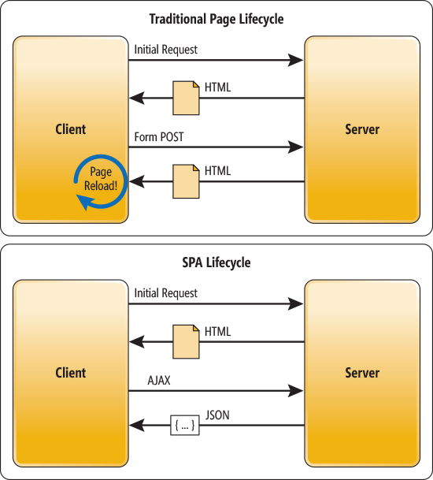

### 1.4.3. **AJAX**

AJAX son las siglas de Asyncronous JavaScript and XML. Se trata de usar el asíncronismo de JavaScript y la posibilidad de comunicarnos con servidores por medio de llamadas HTTP y XML para la posibilidad de consultar información.


### 1.4.4. **Render**

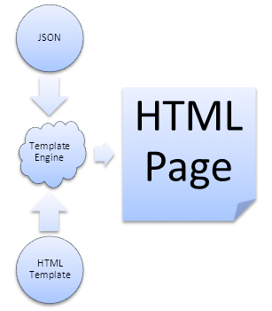

### 1.4.5. **DOM y HTML**

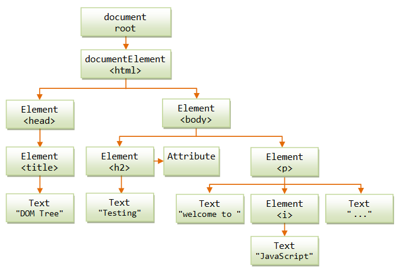
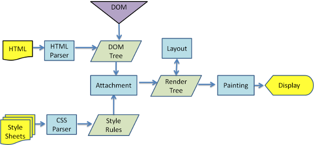

### 1.4.6. **Preprocesadores**

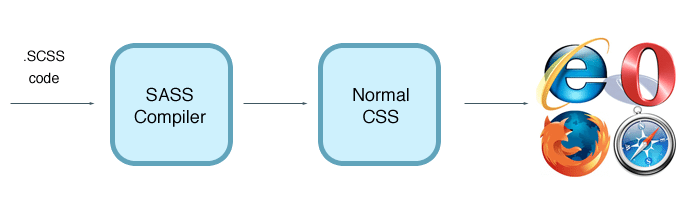

### 1.4.7. **Transpiladores**
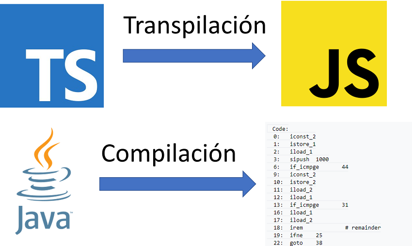
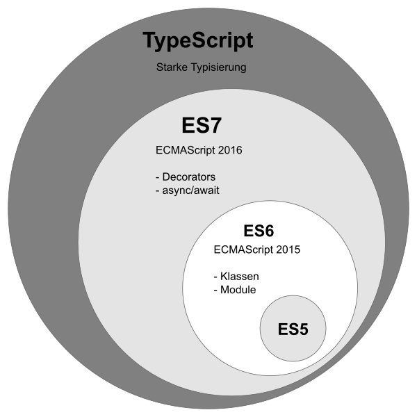

## 1.5. ¿Qué es VueJS?

* Framework/Librería (según cómo se mire) JavaScript
* Nos permite crear aplicaciones SPA o MPA
* Versátil: nos permite usarlo en Web, móvil o Escritorio
* Orientado a componentes
* Los componentes usan MVVM
* Orientado al dato
* Es un framework reactivo
* Hace uso de Virtual DOM

## 1.6. ¿Los componentes usan MVVM?

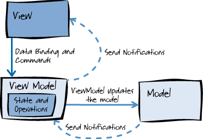

## 1.7. ¿Qué es Virtual DOM?

Debido a que cambiar algo del DOM es muy costoso en tiempo de ejecución y sabiendo que un sistema como Vue puede suponer un elevado número de cambios en DOM, se mantiene una copia en memoria de la estructura DOM deonominada Virtual DOM.

Esta estructura se encarga de realizar comprobaciones con los modelos de datos y de contrastar y analizar cuales son los cambios reales que hay que hacer en el DOM. Cuando el Virtual DOM tiene claro los cambios afectados, simplemente cambia esos nodos. Ganamos en rendimiento y en tiempo de renderizado.


## 1.8. ¿Qué cosas voy a poder hacer con VueJS?

  * Aplicaciones Web gracias a Vue + VueRouter + Vuex
  * Webs estáticas gracias Nuxt
  * Aplicaciones móviles gracias a VueNative o Weex
  * Aplicaciones de escritorio gracias a Vue y Electron
  * Documentación técnica gracias a VuePress

## 1.9. Pero... ¿por qué VueJS? ¿Por qué estamos aprendíendolo hoy?

* **Fácil de usar**: API sencilla y simple
* **Aprendizaje y uso progresivo**: usa lo que necesites
* **Modular**: código reutilizable y fácil de probar
* **Orientado a negocio**: arquitectura robusta, céntrate en desarrollar lo que necesitas
* **Trabajo entre diferentes perfiles**: Nos permite a maquetadores y programadores trabajar juntos con un lenguaje común.
* **Concenciado con los estándar** y las últimas técnicas Web.
* **Mucha comunidad y activa**: todo son herramienta Full Open Source
* **Ligero y rápido**: es una librería pequeña y muy optimizada
* **Muchas herramientas** para mejorar la experiencia de desarrollo

## 1.10. ¿Framework o librería?

Mejor llamémoslo ecosistema. Existe tal cantidad de librerías y utilidades que el ciclo de vida del softaware se encuentra cubierto gracias a Vue. Solo tenemos que mirar en **Awesome Vue** para darnos cuenta de la cantidad de información y ayuda que hay:

* [Awesome Vue](https://github.com/vuejs/awesome-vue)

Aprovechemos e instalemos dos de las herramientas con las que vamos a trabajar por el momento:

* [Visual Studio Code + Vetur](https://marketplace.visualstudio.com/items?itemName=octref.vetur)
* [Google Chrome + Vue Dev Tools](https://chrome.google.com/webstore/detail/vuejs-devtools/nhdogjmejiglipccpnnnanhbledajbpd?hl=es)

## 1.11. Diferentes partes del framework

Vue está modularizado. De esta forma, solo te tienes que preocupar por añadir aquellos recursos que tu necesites. Mira la imágen:

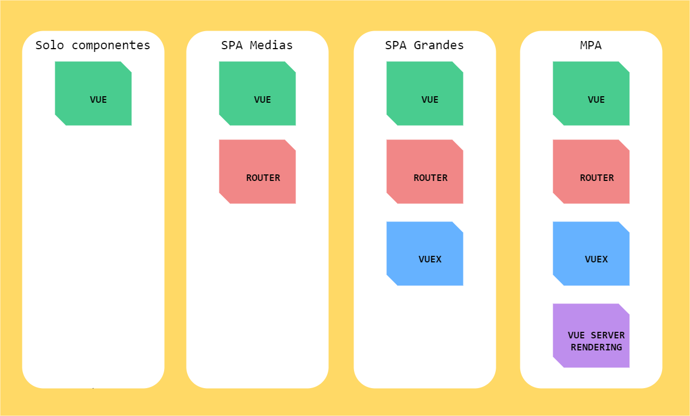

Depediendo de cómo vaya creciendo tu aplicación, necesitaremos más o menos funcionalidad extra. 

Por ejemplo, si me encuentro **desarrollando una aplicación simple con muy poca carga lógica, pero mucha carga visual** donde pueda reutilizar muchas partes, solo incluiremos `vue` como librería.

Sin embargo, si nuestra **aplicación empieza a crecer (imaginemos que queremos hacer un pequeño backoffice)**, necesitaremos gestionar, además de componentes visuales, diferentes pantallas y estados por los que pasará el usuario es ahí donde `vue-router`.

Si nuestra aplicación sigue creciendo, cada vez **gestionaremos mayor cantidad de información, nos integraremos a varias APIS o incluso muchos componentes empezarán a comunicarse entre sí**, necesitaremos incluir `vuex`.

La cosa no termina ahí, imaginate que estamos creando una **gran tienda online donde el SEO y la velocidad es clave para conseguir ventas**. Sería buena idea que pudieramos compilar y renderizar nuestras vistas en el lado del servidor. `vue-server-rendering` nos ayudará a conseguirlo

## 1.12. ¿En qué se parece y se diferencia con otros frameworks?

### 1.12.1. React
  * Se parecen:
    * Tienen Virtual DOM
    * Sons reactivos
    * Permiten crear componentes
    * Son modulares
    * Tamaño y procesamiento parecido
  * Se diferencian:
    * Vue usa un motor de plantillas para renderizar HTML y React usa JSX.
    * Gestión diferente del CSS
    * React tiene una ligera curva de aprendizaje mayor que Vue.

### 1.12.2. AngularJS
  * Se parecen:
    * Doble data binding
    * Uso de directivas y componentes
  * Se diferencian:
    * Vue es más flexible
    * Vue es más ligero

### 1.12.3. Angular
  * Se parecen:
    * Permiten crear componentes
    * Son modulares
    * Son rápidos
  * Se diferencian:
    * Angular 'acoplado' con TypeScript. En Vue es opcional
    * Vue es más ligero

# 2. Creando componentes visuales con `vue`

## 2.1. ¿Cómo empezamos?

Antes de poder hacer nada con Vue, necesitamos entender qué es un componente. Un componente es:

  * Un bloque, pieza o elemento que realiza una o varias funcionalidades específicas.
  * Es aquello que permite crear una composición mayor por medio de asociaciones o contiguedades.
  * Nos permite conectar unos componentes con otros por medio de un sistema de entrada salida.
  * Son reutilizables y reusables.

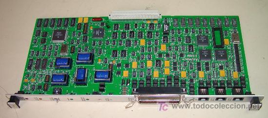

Y qué es un componente Web:

  * Es bloque, pieza o elemento formado por HTML, CSS y/o JavaScript con una o varias funcionalidades específicas.
  * Nos permite crear componentes Web más grande por medio de la composición y la contiguidad de otros componentes más pequeños o específicos.
  * Los componentes Web tienen una serie de parámetros de entrada que nos permite configurar un componente y devuelven HTML plano.
  * Son reutilizables y reusables.

## 2.2. ¿Qué es desarrollo orientado a componentes en Web?


# 2.3. ¿En qué nos ayudan?

Nos permite escribir código HTML, CSS y JS:

* Más reutilizable
* Más testeable
* Más mantenible

## 2.3.1. Tipos de componentes

Dentro de una Web, tenemos diferentes tipos de componentes dependiendo de su nivel de especifidad o complejidad. 

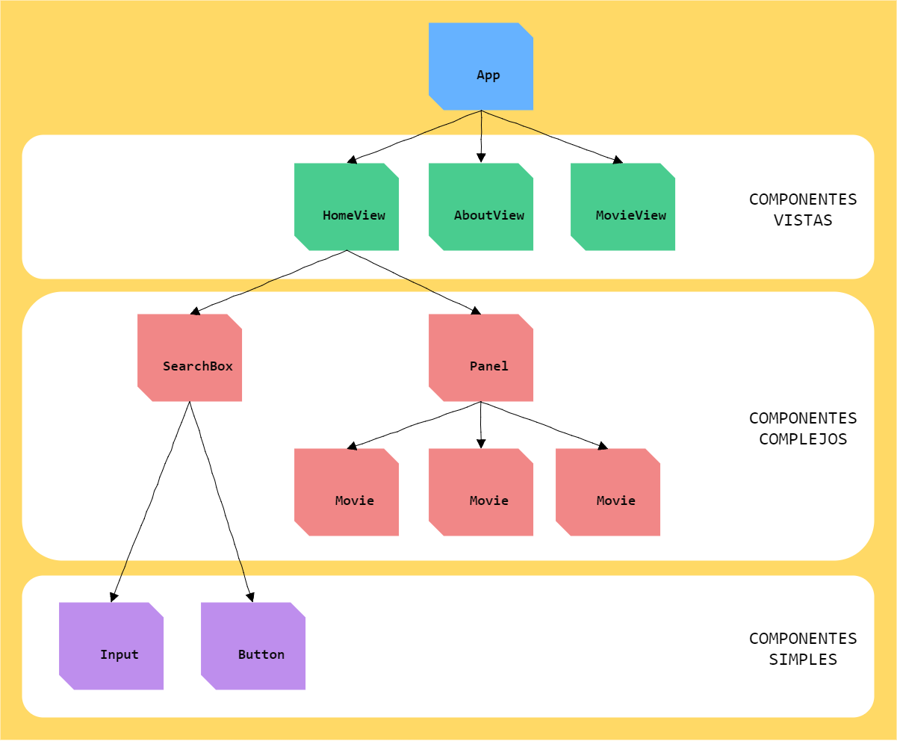

* **Componentes Simples**: son aquellos componentes más 'cercanos' al HTML. Envuelven elementos simples que se encuentran en el estándar. Algunos ejemplos son el componente `Input` o `Button`. Son muy reutilizables y están muy desacoplados del negocio.
* **Componentes Compuestos**: son aquelos componentes más complejos formados de compuestos simples. Son componentes acoplados a negocio. Son menos reutilizables, pero aportan más valor por realizar funcionalidades específicas. Algunos ejemplos son: Un componente `Movie` que muestra la información de una película con un formato específico.
* **Componentes Vista**: Orquestan toda la lógica de una pantalla de nuestra aplicación. Muy acoplados ya que tienen un funcionamiento muy específico. La pantalla  `Home` o `About` son componentes de este tipo.
* **Componente Raíz o de Aplicación**: Orquestan toda la aplicación. Solo hay un componente por aplicación. Lógicamente no son reituilizables.

## 2.4. De jQuery a Vue (I)

¿Y hasta ahora no hemos creado componentes? Practiquemos un poco. Tenemos que construir:

* TODO List
* Insertamos tareas por medio de un formulario
* Mostramos este listado de TODO
* Cuando refrescamos pantalla, tienen que seguir los TODO
* Nos tiene que permitir eliminar los TODO
* Solo podemos usar HTML y CSS (Sin librerías) y JS (Se permite jQuery)
* Intentemos pensar en componentes
* Este es un posible diseño:

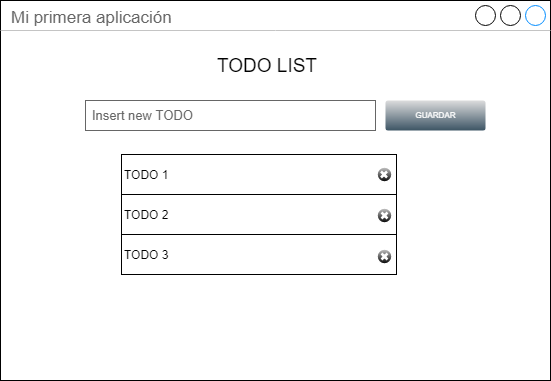

¿Nos ha resultado fácil desarrollarlo? ¿Es un código reutilizable? ¿Es fácil de probar automáticamente? ¿Es fácil de mantener? ¿Separamos bien los conceptos?

## 2.5. Ahora sí, empecemos con Vue

Para empezar a usar vue, tenemos que instalar su dependencia. En Web y si de primeras no queremos complicarnos mucho más, con crear una referencia a su [CDN](https://www.hostingexperto.es/que-es-un-cdn/) nos valdría. Por ejemplo así:

```html
<!DOCTYPE html>
<html lang="en">
<head>
    <meta charset="UTF-8">
    <meta name="viewport" content="width=device-width, initial-scale=1.0">
    <meta http-equiv="X-UA-Compatible" content="ie=edge">
    <title>Instalamos Vue</title>
</head>
<body>
    
    <script src='https://cdnjs.cloudflare.com/ajax/libs/vue/2.5.17/vue.js'></script>
</body>
</html>
```

Esta librería puedo instalarla de tres maneras diferentes:

* Por medio de CDN (como en el ejemplo anterior)
* Descargándonos la librería y guardándola en nuestro servidor
* Usando NPM (Lo veremos en el futuro)

A partir de aquí, ya podemos usar Vue.

Lo siguiente que tenemos que hacer es indicar a partir de qué elemento de nuestro HTML queremos que Vue realice su magia. Por ejemplo:


```html
<!DOCTYPE html>
<html lang="en">
<head>
    <meta charset="UTF-8">
    <meta name="viewport" content="width=device-width, initial-scale=1.0">
    <meta http-equiv="X-UA-Compatible" content="ie=edge">
    <title>Instalamos Vue</title>
</head>
<body>
  <div id="my-site">
    <-- HTML NO accesible por Vue -->

    <div id="my-app-vue">
      <-- HTML SI accesible por Vue -->
    </div>

    <-- HTML NO accesible por Vue -->
  </div>

  <script src='https://cdnjs.cloudflare.com/ajax/libs/vue/2.5.17/vue.js'></script>
</body>
</html>
```

En este caso, para Vue, el nodo `my-app-vue` es su nodo raiz. Que podamos indicar un espacio donde vue pueda funcionar, nos permite incluir vue, en aplicaciones que ya usan otras tecnologías. 

Lo siguiente que haremos, será inicializar vue. Para ello, crearemos un fichero js llamado `app.js` y lo vincularemos en el HTML de esta manera:

```html
<!DOCTYPE html>
<html lang="en">
<head>
    <meta charset="UTF-8">
    <meta name="viewport" content="width=device-width, initial-scale=1.0">
    <meta http-equiv="X-UA-Compatible" content="ie=edge">
    <title>Instalamos Vue</title>
</head>
<body>
  <div id="my-app"></div>

  <script src="https://cdnjs.cloudflare.com/ajax/libs/vue/2.5.17/vue.js"></script>
  <script src="app.js"></script>
</body>
</html>
```

Lo enlazamos después de vue, pues necesitamos usar su API. Hemos puedo una única etiqueta div con un identificador `my-app` para simplificar. Este nodo será el que usemos para anclar vue.

Lo siguiente es instanciar el contexto de vue en `app.js`:

```js
// ./app.js

const app = new Vue({
  el: '#my-app'
})
```

Lo que estamos haciendo es instanciar la clase `Vue` e indicándole a la librería que tiene que montar toda nuestra aplicación dentro del elemento de HTML (parámetros `el`) con id `#my-app`.

Lo siguiente que vamos a hacer es mostrar una variable por pantalla. Para ello, usamos el atributo `data`:

```js
// ./app.js

const app = new Vue({
  el: '#my-app',
  data: {
    text: 'Este es mi primer mensaje en Vue'
  }
})
```

En el HTML, lo que hacemos es un 'enlace' directo (no muestro el HEAD ni el BODY para que el ejemplo quede claro):

```html
<div id="my-app">
  {{ text }}
</div>
```

Vue nos genera el siguiente HTML:

```html
<div id="my-app">
  Este es mi primer mensaje en Vue
</div>
```

Tenemos otra manera de indicar dónde tiene que instalarse o montarse nuestra aplicación en el HTML:

```js
// ./app.js

var app = new Vue({
  data: {
    text: 'Este es mi primer mensaje en Vue'
  }
})

app.$mount('#my-app')
```

Podemos acceder a los datos de nuestra instancia en todo momento:

```js
// ./app.js

const app = new Vue({
  el: '#my-app',
  data: {
    text: 'Este es mi primer mensaje en Vue'
  }
})

alert(app.text)
```

Tambien podemos cambiar los datos:

```js
// ./app.js

const app = new Vue({
  el: '#my-app',
  data: {
    text: 'Este es mi primer mensaje en Vue'
  }
})

setTimeout(() => {
  app.text = 'Nuevo mensaje en Vue' // escritura
  alert(app.text) // lectura
}, 2000)
```

## 2.6. Nuestro primer componente

Cuando creamos una instancia de Vue, lo que estamos creando es la raiz de una aplicación. Esto nos permite contar con todas las ficilidades de Vue. Podríamos escribir toda nuestr código en esta instancia.

Sin embargo, es bueno dividir nuestro código en partes más pequeña. Empecemos a crear componentes Web.

Para crear un contamos con este método estático: `Vue.component()`. Esto nos va a permitir registrar nuestro componentes.

### 2.6.1. El componente `Hello World`

Tenemos el mismo HTML y la misma instancia anteriores:

```html
<div id="my-app">
  {{ text }}
</div>
```
```js
// ./app.js

const app = new Vue({
  el: '#my-app',
  data: {
    text: 'Este es mi primer mensaje en Vue'
  }
})
```

Para crear un componente lo hacemos de la siguiente manera:

1. Registramos un componente con Vue. Tenemos que indicar un nombre para el componente y una configuración: 

```
Vue.component(nombre, configuración)
```

```js
// ./app.js

Vue.component('hello-world', {
  template: `
    <h1>Hola mundo! Mi nombre es {{ name }}</h1>
  `,
  data() {
    return {
      name: 'Jose'
    }  
  }
})

// código de la instancia vue...
```

2. Lo siguiente, simplemente tenemos que usar el componente en el HTML:

```html
<div id="my-app">
  <p>{{ text }}</p>
  <hello-world></hello-world>
</div>
```

> TIP: Los nombres de los componentes siempre compuestos. Podemos escribir el componente con `kebak-case` o `PascalCase`

### 2.6.2. Registro de componentes

Hay dos formas:

* **Registro global**: Nos permite usarlo desde cualquier componente que se encuentre registrado dentro de nuestra aplicación (como hemos hecho en el apartado anterior)
* **Registro local**: Nos permite usarlo simplemente dentro del componente donde lo hemos registrado. 

> **TIP** Usa el registro global para registrar componentes muy visuales o simples que se usan en muchas partes de tu aplicación. Úsalo cuando generes una librería de componentes visuales (estilo Vuetify o vue-material). 

> **TIP** Cuando tus componentes se usen menos, tengan dependencias los unos de los otros, o está refactorizando un componente grande en otros más pequeños, usa el registro local.

Para registrar un componente local, usaríamos el atributo `components`.

```js
// ./app.js

const HelloWorld = {
  template: `
    <h1>Hola mundo! Mi nombre es {{ name }}</h1>
  `,
  data() {
    return {
      name: 'Jose'
    }  
  }
}

const app = new Vue({
  el: '#my-app',

  components: {
    HelloWorld
  },

  data: {
    text: 'Este es mi primer mensaje en Vue'
  }
})
```

## 2.7. Reactividad de los datos (data y methods)

Vue es un sistema reactivo. Esto significa que Vue se encargará de realizar acciones de manera proactiva a partir de cambios que se realicen sobre los datos de los componentes.

El dibujo siguiente, es el sistema que usa vue para ser proactivo a la hora de realizar acciones


En un sistema como vue, no tenemos que imperativamente indicar cuando los datos se tienen que renderizar en una Web. El mismo, por medio del anterior mecanismo, es capaz de saber cómo hacerlo. Nosotros solo tenemos que indicar los datos y declarar el HTML de manera declarativa dónde se tienen que modificar en caso de que cambien.

Para ver este mecanismo, vamos a realizar un ejemplo. Vamos a crear [contadores](ejemplos/03-contador/app.js):


```js
// ./app.js

Vue.component('button-counter', {
  template: `<button v-on:click="add">Este contador vale {{ counter }}</button>`,

  data() {
    return {
      counter: 0
    }
  },

  methods: {
    add() {
      this.counter++
    }
  }
})

const app = new Vue({
  el: '#my-app'
})
```

```html
<div id="my-app">
  <button-counter></button-counter>
  <button-counter></button-counter>
  <button-counter></button-counter>
</div>
```


## 2.8. De jQuery a Vue (II)

* TODO List (Ahora en vue)
* Insertamos tareas por medio de un formulario
* Mostramos este listado de TODO
* Cuando refrescamos pantalla, tienen que seguir los TODO
* Nos tiene que permitir eliminar los TODO
* Solo podemos usar CSS y Vue
* Intentemos pensar en componentes
* Pistas: hay que usar `v-on`, `v-model` y `v-for` (los explicaremos en el curso)

¿Nos ha resultado fácil desarrollarlo? ¿Es un código reutilizable? ¿Es fácil de probar automáticamente? 