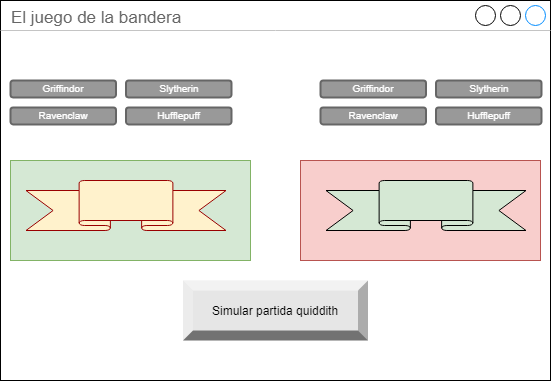

# Clase 2

## Planning del día

1. Repaso clase anterior
2. Ciclo de vida de un componente de Vue
3. Realizar nuestra primera llamada AJAX
4. Renderizando modelos por pantalla
5. Ejercicio "Mostrando datos de una API"
6. Renderizando estilos por pantalla
7. Ejercicio "El juego de la bandera"

## Índice

* [1. El ciclo de vida de un componente](#1.-El-ciclo-de-vida-de-un-componente)
  * [1.1. **Creación** de un componente](#1.1.-Creación-de-un-componente)
    * [1.1.1. beforeCreate](#1.1.1.-beforeCreate)
    * [1.1.2. created](#1.1.2.-created)
  * [1.2. **Montaje** de un componente](#1.2.-Montaje-de-un-componente)
    * [1.2.1. beforeMount](#1.2.1.-beforeMount)
    * [1.2.2. mounted](#1.2.2.-mounted)
  * [1.3. **Actualización** de un componente](#1.3.-Actualización-de-un-componente)
    * [1.3.1. beforeUpdate](#1.3.1.-beforeUpdate)
    * [1.3.2. updated](#1.3.2.-updated)
  * [1.4. **Destrucción** de un componente](#1.4.-Destrucción-de-un-componente)
    * [1.4.1. beforeDestroy](#1.4.1.-beforeDestroy)
    * [1.4.2. destroyed](#1.4.2.-destroyed)
* [2. Renderizando modelos por pantalla](#2.-Renderizando-modelos-por-pantalla)
  * [2.1. Interpolaciones](#2.1.-Interpolaciones)
    * [2.1.1. Interpolando texto](#2.1.1.-Interpolando-texto)
    * [2.1.2. Interpolando html](#2.1.2.-Interpolando-html)
    * [2.1.3. Interpolando atributos](#2.1.3.-Interpolando-atributos)
    * [2.1.4. Usando expresiones JavaScript](#2.1.4.-Usando-expresiones-JavaScript)
  * [2.2. Directivas](#2.2.-Directivas)
    * [2.2.1. Argumentos](#2.2.1.-Argumentos)
    * [2.2.2. Modificadores](#2.2.2.-Modificadores)
    * [2.2.3. Shorthands](#2.2.3.-Shorthands)
  * [2.3. Manejador de eventos](#2.3.-Manejador-de-eventos)
    * [2.3.1. Manejar un evento con una expresión](#2.3.1.-Manejar-un-evento-con-una-expresión)
    * [2.3.2. Manejar un evento con un método](#2.3.2.-Manejar-un-evento-con-un-método)
    * [2.3.3. Manejar un evento con un método inline](#2.3.3.-Manejar-un-evento-con-un-método-inline)
    * [2.3.4. Modificadores para eventos](#2.3.4.-Modificadores-para-eventos)
    * [2.3.5. Modificadores para eventos de teclado](#2.3.5.-Modificadores-para-eventos-de-teclado)
    * [2.3.6. Combinación de modificadores para teclado](#2.3.6.-Combinación-de-modificadores-para-teclado)
    * [2.3.7. Modificadores de boton de ratón](#2.3.7.-Modificadores-de-boton-de-ratón)
  * [2.4. Renderizado condicional](#2.4.-Renderizado-condicional)
    * [2.4.1. Renderizado condicional de un grupo](#2.4.1.-Renderizado-condicional-de-un-grupo)
    * [2.4.2. Renderizado condicional con `v-show`](#2.4.2.-Renderizado-condicional-con-v-show)
  * [2.5. Renderizando listados](#2.5.-Renderizando-listados)
    * [2.5.1. Identificando los objetos para su actualización](#2.5.1.-Identificando-los-objetos-para-su-actualización)
    * [2.5.2. Métodos de mutación](#2.5.2.-Métodos-de-mutación)
    * [2.5.3. Reemplazando el array](#2.5.3.-Reemplazando-el-array)
    * [2.5.4. Limitaciones y trucos con la mutación de arrays](#2.5.4.-Limitaciones-y-trucos-con-la-mutación-de-arrays)
    * [2.5.5. Limitaciones y trucos con la mutación de objetos](#2.5.5.-Limitaciones-y-trucos-con-la-mutación-de-objetos)
    * [2.5.6. Renderizando un rango](#2.5.6.-Renderizando-un-rango)
    * [2.5.7. Iterando un conjunto de HTML](#2.5.7.-Iterando-un-conjunto-de-HTML)
    * [2.5.8. `v-for` con `v-if`](#2.5.8.-v-for-con-v-if)
  * [2.6. Ejercicio "Mostrando datos de una API"](#2.6.-Ejercicio-"Mostrando-datos-de-una-API")
  * [2.7. Enlazando clases y estilos CSS](#2.7.-Enlazando-clases-y-estilos-CSS)
    * [2.7.1. Enlazando clases](#2.7.1.-Enlazando-clases)
      * [2.7.1.1. Sintaxis en forma objeto](#2.7.1.1.-Sintaxis-en-forma-objeto)
      * [2.7.1.2. Sintaxis en forma Array](#2.7.1.2.-Sintaxis-en-forma-Array)
      * [2.7.1.3. Con componentes](#2.7.1.3.-Con-componentes)
    * [2.7.2. Enlazando estilos CSS en línea](#2.7.2.-Enlazando-estilos-CSS-en-línea)
      * [2.7.2.1. Sintaxis en forma objeto](#2.7.2.1.-Sintaxis-en-forma-objeto)
      * [2.7.2.2. Sintaxis en forma Array](#2.7.2.2.-Sintaxis-en-forma-Array)
  * [2.8. Ejercicio "El juego de la bandera"](#2.8.-Ejercicio-"El-juego-de-la-bandera")

# 1. El ciclo de vida de un componente

Todo componente (ya sea el componente raiz o instancia o un subcomponente) tiene un determinado ciclo de vida basado en 4 fase:

* Creación
* Montaje
* Actualización
* Destrucción

Cada fase tiene sus dos hooks correspondientes. Un hook, o garfio (:S), es un momento especifico dentro del ciclo de vida de un componente donde vue nos deja ejecutar funcionalidad. Dependiendo de en que fase del ciclo nos encontremos, tendremos acceso a unas cosas u otras y realizaremos unas acciones especificas. 

Si cada fase del ciclo tiene dos hooks, significa que tenemos 8 momentos para ejecutrar funcionalidad dentro de un componente. 

Podemos ver el ciclo completo en este diagrama:


## 1.1. **Creación** de un componente

Un componente cuenta con un estado de creación. Este estado se produce entre la instanciación y el montaje del elemento en el DOM. Cuenta con dos hooks:

### 1.1.1. beforeCreate

Este hook se realiza nada más instanciar un componente. Durante este hook no tiene sentido acceder al estado del componente pues todavía no se han registrado los observadores de los datos, ni se han registrado los eventos.

Aunque pueda parecer poco útil, utilizar este hook puede ser es un buen momento para dos acciones en particular:

1. **Para configurar ciertos parámetros internos u opciones, inherentes a las propias funcionalidad de VueJS**. Un caso de uso común es cuando queremos evitar  referencias circulares entre componentes. Cuando usamos una herramienta de empaquetado de componentes, podemos entrar en bucle infinito por culpa de dichas referencias. Para evitar esto, podemos cargar el componente de manera ‘diferida’ para que el propio empaquetador no se vuelva loco.

```js
const component1 = {
    beforeCreate: function () {
        this.$options.components.Component2 
            = require('./component2.vue');
    }
};
````

2. **Para iniciar librerías o estados externos**. Por ejemplo, imaginemos que queremos iniciar una colección en localSotrage para realizar un componente con posibilidad de guardado offline. Podríamos hacer lo siguiente:

```js
const component = {
    destroyed: function () {
        localStorage.setItem('tasks', []);
    }
};
```

### 1.1.2. created

Cuando se ejecuta este hook, el componente acaba de registrar tanto los observadores como los eventos, pero todavía no ha sido ni renderizado ni incluido en el DOM. Por tanto, tenemos que tener en cuenta que dentro de created no podemos acceder a $el porque todavía no ha sido montado.

Es uno de los más usados y nos viene muy bien para iniciar variables del estado de manera asíncrona. Por ejemplo, necesitamos que un componente pinte los datos de un servicio determinado. Podríamos hacer algo como esto:

```js
const component = {
    created: function () { 
        axios.get('/tasks') 
            .then(response => this.tasks = response.data) 
            .catch(error => this.errors.push(error));
    }
};
```


## 1.2. **Montaje** de un componente

Una vez que el componente se ha creado, podemos entrar en una fase de montaje, es decir que se renderizará e insertará en el DOM. Puede darse el caso que al instanciar un componente no hayamos indicado la opción el. De ser así, el componente se encontraría en estado creado de manera latente hasta que se indique o hasta que ejecutemos el método $mount que lo que provocará es que el componente se renderice, pero no se monte (el montaje sería manual).

### 1.2.1. beforeMount
Se ejecuta justo antes de insertar el componente en el DOM, justamente, en tiempo de la primera renderización de un componente. Es uno de los hooks que menos usarás y, como muchos otros, se podrá utilizar para trazar el ciclo de vida del componente.

A veces se usa para iniciar variables, pero yo te recomiendo que delegues esto al hook created.

### 1.2.2. mounted
Es el hook que se ejecuta nada más renderizar e incluir el componente en el DOM. Nos puede ser muy útil para inicializar librerías externas. Imagínate que estás haciendo uso, dentro de un componente de VueJS, de un plugin de jQuery. Puede ser buen momento para ejecutar e iniciarlo en este punto, justamente cuando acabamos de incluirlo al DOM.

Lo usaremos mucho porque es un hook que nos permite manipular el DOM nada más iniciarlo. Un ejemplo sería el siguiente. Dentro de un componente estoy usando el plugin buttonde jQuery  UI (Imaginemos que es un proyecto legado y no me queda otra). Podríamos hacer esto:

```js
const component = {
    mounted: function () {
        $(".selector").button({});
    }
};
```

## 1.3. **Actualización** de un componente

Cuando un componente ha sido creado y montado se encuentra a disposición del usuario. Cuando un componente entra en interacción con el usuario pueden darse eventos y cambios de estados. Estos cambios desembocan la necesidad de tener que volver a renderizar e incluir las diferencias provocadas dentro del DOM de nuevo. Es por eso, que el componente entra en un estado de actualización que también cuenta con dos hooks.

### 1.3.1. beforeUpdate

Es el hook que se desencadena nada más que se provoca un actualización de estado, antes de que se se comience con el re renderizado del Virtual DOM y su posterior ‘mapeo’ en el DOM real.

Este hook es un buen sitio para trazar cuándo se provocan cambios de estado y se desembocan renderizados que nosotros no preveíamos o que son muy poco intuitivos a simple vista. Podríamos hacer lo siguiente:

```js
const component = {
    beforeUpdate: function () {
        console.log('Empieza un nuevo renderizado de component');
    }
};
```

Puedes pensar que es un buen sitio para computar o auto calcular estados a partir de otros, pero esto es desaconsejado. Hay que pensar que estos hooks son todos asíncronos, lo que significa que si su algoritmo interno no acaba, el componente no puede terminar de renderizar de nuevo los resultados. Con lo cual,cuidado con lo que hacemos internamente de ellos. Si necesitamos calcular cómputos, contamos con funcionalidad específica en VueJS por medio de Watchers o Computed properties.

### 1.3.2. updated

Se ejecuta una vez que el componente ha re renderizado los cambios en el DOM real. Al igual que ocurría con el hook mounted es buen momento para hacer ciertas manipulaciones del DOM externas a VueJS o hacer comprobaciones del estado de las variables en ese momento.

Puede que tengamos que volver a rehacer un componente que tenemos de jQuery, Aquí puede ser buen momento para volver a lanzarlo y hacer un refresh o reinit:

```js
const component = {
    updated: function () {
        $(".selector").button("refresh");
    }
};
````

## 1.4. **Destrucción** de un componente

Un componente puede ser destruido una vez que ya no es necesario para el usuario. Esta fase de desencadena cuando queremos eliminarlo del DOM y destruir la instancia de memoria.

### 1.4.1. beforeDestroy

Se produce justamente antes de eliminar la instancia. El componente es totalmente operativo todavía y podemos acceder tanto al estado interno, como a sus propiedades y eventos.

Suele usarse para quitar eventos o escuchadores . Por ejemplo:

```js
const component = {
    beforeDestroy: function () {
        document.removeEventListener('keydown', this.onKeydown);
    }
};
```

### 1.4.2. destroyed

Tanto los hijos internos, como las directivas, como sus eventos y escuchadores han sido eliminados. Este hook se ejecuta cuando la instancia ha sido eliminada. Nos puede ser muy útil para limpiar estados globales de nuestra aplicación.

Si antes habíamos iniciado el localStorage con una colección para dar al componente soporte offline, ahora podríamos limpiar dicha colección:

```js
const component = {
    destroyed: function () {
        localStorage.removeItem('tasks');
    }
};
```
# 2. Renderizando modelos por pantalla

Cómo se van a pintar nuestros datos en pantalla es una de las funciones de todo front. Vue al contar con un sistema de renderizado de pnatillas y enlazado de datos reactivo, todo se hará indicando diferentes elementos declarativos en nuestro HTML.

Vue nos permite extender HTML con una serie de nuevas etiquetas y atributos especificas con un comportamiento especifico que nos permitirá renderizar lo que necesitemos en HTML nativo.

Vamos a ver cómo declarar todo de una manera sencilla:

## 2.1. Interpolaciones

Una interpolación es la posibilidad de convertir modelos de datos en cadenas de texto que puedan mostrarse en pantalla. Veremos cómo:

### 2.1.1. Interpolando texto

La forma más sencilla de interpolar una variable dentro del HTML es por medio de las dobles llaves, también llamadas en el mundillo front como 'bigotes'.

Si yo tengo un dato llamo `msg` dentro de mi componente, yo podría hacer esto:

```html
<span>Mensaje: {{ msg }}</span>
```

### 2.1.2. Interpolando html

Vue siempre interpola el contenido de una variable en una cadena de texto. No entiende de otra cosa. Por ejemplo, si dentro de una variable, nosotros almacenamos más HTML, Vue nos lo pintará como una cadena!!.

Contamos con una directiva que nos permite renderizar el contenido de una variable con HTML en DOM. 

Veamos la siguiente plantilla de nuestro componente:

```html
<p>Usando mustaches: {{ rawHtml }}</p>
<p>Usando la directiva v-html: <span v-html="rawHtml"></span></p>
```

El primer caso, pintará una cadena de texto. La segunda renderizará ese texto en HTML (si es posible).

> TIP: Cuidado con renderizar HTML que no controlemos. Esto puede ser una vulnerabilidad del sistema


### 2.1.3. Interpolando atributos

No solo se puede interpolar datos como texto dentro de un nodo hoja. Tambien podemos dar valores a nuestros atributos. Por ejemplo:

```html
<div v-bind:id="dynamicId"></div>
```

Lo que estamos haciendo es que el `id` de este `div` sea dinámico y tenga el valor que haya en cada momento en `dynamicId`.

Podemos hacerlo tambien con valores booleanos y las propiedades binarias:

```html
<button v-bind:disabled="isButtonDisabled">Button</button>
```

En este caso si `isButtonDisabled` es `true`, el botón se renderizará con la propiedad `disabled`. Si contiene un `false` no lo renderizará y el botón estaría habilitado para ser pulsado.

### 2.1.4. Usando expresiones JavaScript 

Dentro de una interpolación podemos hacer cosas tan chulas como ejecutar expresiones. Vue sabe evaluar expresiones en tiempo de renderizado.

Podremos hacer cosas como estas:

```html
{{ number + 1 }}

{{ ok ? 'YES' : 'NO' }}

{{ message.split('').reverse().join('') }}

<div v-bind:id="'list-' + id"></div>
```

SIn embargo, para evitar un uso indebido, se recomienda hacer un uso controlado de expresiones en un template. 

Además, no podremos hacer cosas como asignaciones o controles de flujo. Las siguientes interpolaciones no funcionarán en vue:

```html
<!-- Esto es una asignación, no una expresión: -->
{{ var a = 1 }}

<!-- Los controles de flujo no funcionan, pero si una expresión ternaria -->
{{ if (ok) { return message } }}
```

## 2.2. Directivas

Antes hemos comentado que vue nos otorga directivas. Una directiva es una serie de atributos HTML que realizan funcionalidades especificas. Vue cuenta con muchas directivas que nos permiten enlazar datos, incluir eventos o renderizar coleciones, entre otras opciones. Iremos viendo muchas a lo largo del curso:

Una directiva vue se caracteriza en que siempre empieza con el prefijo `v-`.

En este ejemplo, estamos usando una directiva que nos permite renderizar o no un nodo determinado dependiendo del valor de una variable:

```html
<p v-if="seen">Ahora me ves</p>
```

### 2.2.1. Argumentos

Una directiva puede tener argumentos. Los argumentos son como los parametros de una función, nos va a permitir configurar una directiva con un funcionamiento más específico.

Por ejemplo, `v-bind` es un ejemplo muy claro. Esta directiva nos permite enlazar datos en atributos del estándar.

Aquí le estamos indicando dinámicamente la url que tiene que tener el `href` de este ancla:

```html
<a v-bind:href="url"> ... </a>
```

O como `v-on` que nos permite registrar un evento en un nodo. Le hemos pasado el argumento `click` que está indicando el tipo de evento que queremos registrar:

```html
<a v-on:click="doSomething"> ... </a>
```

### 2.2.2. Modificadores

Aun podemos configurar más una directiva. Podemos modificar el comportamiento por defecto de cierto elementos HTML.

Por ahora quedémonos con que es posible. Más adelante veremos modificadores y el comportamiento nos quedará mucho más claro.

Veamos el ejemplo:

```html
<form v-on:submit.prevent="onSubmit"> ... </form>
```

### 2.2.3. Shorthands

Vue ha pensado en todo y visto que escribir un evento o un enlace de datos es bastante verboso, contamos con una forma corta de expresar un evento o un enlace de datos.

Este es el shorthand para un enlace a datos:

```html
<!-- sintaxis completa -->
<a v-bind:href="url"> ... </a>

<!-- shorthand -->
<a :href="url"> ... </a>
```
Y este es el shorthand para un registro de evento:

```html
<!-- sintaxis completa -->
<a v-on:click="doSomething"> ... </a>

<!-- shorthand -->
<a @click="doSomething"> ... </a>
```

Mucho más claro y conciso. Menos código y autoexplicativo.

## 2.3. Manejador de eventos

En vue, el manejo de eventos se hace indicando el evento en el nodo dónde queremos registrarlo. Muy a la vieja escuela. Volvemos a la modelo `onClick` de HTML.

Como decíamos antes, para indicar un evento, tenemos que usar la idrectiva `v-on` seguido del evento que queremos registrar.

### 2.3.1. Manejar un evento con una expresión

Los eventos en Vue son capaces de ejecutar expresiones inline, no tenemos la necesidad de indicar un método si la ejecución es clara y concisa:

```html
<div id="my-example-1">
  <button v-on:click="counter += 1">Añade 1</button>
  <p>EL botón ha sido pulsado {{ counter }} veces.</p>
</div>
```
```js
var example1 = new Vue({
  el: '#my-example-1',

  data: {
    counter: 0
  }
})
```

### 2.3.2. Manejar un evento con un método

Pero lógicamente, tambien podemos indicar un método :)

```html
<div id="my-example-2">

  <button v-on:click="greet">Saludar!!</button>
</div>
```
```js
var example2 = new Vue({
  el: '#my-example-2',

  data: {
    name: 'Vue.js'
  },

  methods: {
    greet: function (event) {
      alert('Hola ' + this.name + '!')
      
      // event es un evento nativo del DOM
      if (event) {
        alert(event.target.tagName)
      }
    }
  }
})

// Puedes invocar el método tambien
example2.greet() // => 'Hola Vue.js!'
```

Incluso podemos ejecutar esos métodos fuera del propio componente!! Esto es super util cuando tenemos que coexistir con funcionalidad legada.

### 2.3.3. Manejar un evento con un método inline

Podemos indicar parámetros a los métodos para configurar el comportamiento:

```html
<div id="my-example-3">
  <button v-on:click="say('Hola')">Dime Hola!!</button>
  <button v-on:click="say('Qué')">Dime Qué!!</button>
</div>
```
```js
new Vue({
  el: '#my-example-3',
  methods: {
    say: function (message) {
      alert(message)
    }
  }
})
```

### 2.3.4. Modificadores para eventos

Antes de empezar es importante saber la diferencia entre `stopPropagation` y `preventDefault` 

Como ya sabemos, los eventos en JavaScript van ejecutando los eventos de un nodo como si tratasen de una burbuja. Nosotros podemos parar este comprtamiento para solo ejecutar el evento del nodo que nosotros deseemos con el método [stopPropagation](https://codepen.io/felquis/pen/oXYdEz). 

Por otra parte, hay algunos elementos del DOM que tienen eventos por defecto, un ancla, un formulario... ejecutan eventos por defecto. Para evitar ese comportamiento, contamos con el método `preventDefault`.

Estos métodos pueden usarse en Vue en forma de modificadores. Veamos cómo:

```html
<!-- Se detiene la propagación del evento -->
<a v-on:click.stop="doThis"></a>

<!-- el evento submit event no recargará la página (evento por defecto) -->
<form v-on:submit.prevent="onSubmit"></form>

<!-- podemos concatenar modificadores -->
<a v-on:click.stop.prevent="doThat"></a>

<!-- solo incluímos el modificador -->
<form v-on:submit.prevent></form>

<!-- use capture mode when adding the event listener -->
<!-- i.e. an event targeting an inner element is handled here before being handled by that element -->
<div v-on:click.capture="doThis">...</div>

<!-- only trigger handler if event.target is the element itself -->
<!-- i.e. not from a child element -->
<div v-on:click.self="doThat">...</div>
```

### 2.3.5. Modificadores para eventos de teclado

Dentro de los eventos, se dan situaciones en los que tenemos que poner un evento e una tecla especifica del teclado. Existe un keycode numérico que identifica a cada una de las teclas. Podemos usar esto código como modificadores: 

```html
<!-- solo llamará a `vm.submit()` cuando el `keyCode` sea 13 -->
<input v-on:keyup.13="submit">
```

Vue ha dado significado semnántico  a algunas teclas como el `enter` que es el keycode 13:

```html
<!-- solo se llama cuando se pulsa la tecla `enter` -->
<input v-on:keyup.enter="submit">

<!-- tambien funciona con la nomenclatura shorthand -->
<input @keyup.enter="submit">
```

Existen todos estos modificadores de teclado especiales:

* `.enter`
* `.tab`
* `.delete`
* `.esc`
* `.space`
* `.up`
* `.down`
* `.left`
* `.right`

Pero podemos crear todos los que queramos:

```js
// nos permite hace `v-on:keyup.f1`
Vue.config.keyCodes.f1 = 112
```

### 2.3.6. Combinación de modificadores para teclado

Contamos con estos modificadores sobre teclas especiales que por si solas no hacen nada:

* `.ctrl`
* `.alt`
* `.shift`
* `.meta`

```html
<!-- Alt + C -->
<input @keyup.alt.67="clear">

<!-- Ctrl + Click -->
<div @click.ctrl="doSomething">Hacemos algo</div>
```

> TIP: El orden en el que colocamos los modificadores es importante. Por ejemplo, no es lo mismo ejecutar `v-on:click.prevent.self` que quitará todos los eventos por defecto registrados en los nodos con parentesco y ejecutará el evento de donde pinchamos que ejecutar `v-on:click.self.prevent`que solo quitará el evento por defecto de donde hemos pinchado.

### 2.3.7. Modificadores de boton de ratón

Lo mismos nos ocurre con las teclas del ratón:

* `.left`
* `.right`
* `.middle`

## 2.4. Renderizado condicional

Vamos a tener situaciones en las que nuestro modelo deberá ser renderizado o no según cumpla unas condiciones:

* Puede ser que no sepamos si existe el modelo ya que lo obtenemos vía API.
* Puede ser que los datos nos indiquen la información no deba renderizarse.
* O puede ser que tengamos que jugar con varios flujo con el usuario final.

Por todo ello, contamos con una directiva que nos permite renderizar o no ciertas partes de nuestro HTML. Es tan fácil como usar `v-if` y una expresión que evalúe a `true` o a `false`:

En este caso tenemos una variable booleana `ok` que decide si mostramos o no el `h1`:

```html
<h1 v-if="ok">Sí!!</h1>
```

Contamos con una directiva `v-else` para jugar con flujos de renderizado más complejos:

```html
<h1 v-if="ok">Sí!!</h1>
<h1 v-else>Nooo :(</h1>
```
> TIP: la directiva `v-else` siempre tiene que ir debajo de un nodo con la directiva `v-if` o vue no sabrá de su correspondencia a la hora de renderizar.

Incluso contamos con una directiva `v-else-if` que nos permita hacer evaluaciones anidadas:

```html
<div v-if="type === 'A'">
  A
</div>
<div v-else-if="type === 'B'">
  B
</div>
<div v-else-if="type === 'C'">
  C
</div>
<div v-else>
  Not A/B/C
</div>
```

### 2.4.1. Renderizado condicional de un grupo

Puede darse el caso en que tengamos que renderizar un grupo de etiquetas HTML hijas dependiendo de una evalución. Además, puede darse el caso en el que no tenga un nodo raíz.

En este caso contamos con la etiqueta `template` que nos permite renderizar una serie de elementos hijos sin un nodo raíz:

```html
<template v-if="ok">
  <h1>Title</h1>
  <p>Paragraph 1</p>
  <p>Paragraph 2</p>
</template>
```
Esta etiqueta no se mostrará en el DOM. Simplemente es un marcado para el desarrollador:

### 2.4.2. Renderizado condicional con `v-show`

Contamos con otra directiva condicional que puede parecernos igual que `v-if` pero que no lo es. Se llama `v-show`:

```html
<h1 v-show="ok">Hello!</h1>
```
La diferencia que es que `v-show` siempre renderizará el contenido en el DOM. Mostrará y esconderá el contenido por medio de CSS. Esto nos puede suponer ganar tiempos n renderizado en ciertas situaciones, pero nos puede dar problemas de seguridad.


## 2.5. Renderizando listados

Por otra parte, necesitamos una manera de renderizar estructuras repetitivas. En vue contamos con una directiva llamada `v-for` que nos permite rederizar colecciones. Se comporta como un `for in` de JavaScript:

```html
<ul id="example-1">
  <li v-for="item in items">
    {{ item.message }}
  </li>
</ul>
```
```js
var example1 = new Vue({
  el: '#example-1',
  data: {
    items: [
      { message: 'Foo' },
      { message: 'Bar' }
    ]
  }
})
```
El elemento `li` se renderizará por cada uno de los elementos que tenga la colección `items`. En este caso 2 veces.

Además, en cada iteración, tenemos acceso al indice que ocupa el item en la colección:

```html
<ul id="example-2">
  <li v-for="(item, index) in items">
    {{ parentMessage }} - {{ index }} - {{ item.message }}
  </li>
</ul>
```
```js
var example2 = new Vue({
  el: '#example-2',
  data: {
    parentMessage: 'Parent',
    items: [
      { message: 'Foo' },
      { message: 'Bar' }
    ]
  }
})
```

Este mecanismos tambien funciona con objetos. Podemos iterar las propiedades de un objeto de esta forma:

```html
<ul id="v-for-object" class="demo">
  <li v-for="value in object">
    {{ value }}
  </li>
</ul>
```
```js
new Vue({
  el: '#v-for-object',
  data: {
    object: {
      firstName: 'John',
      lastName: 'Doe',
      age: 30
    }
  }
})
```

En este caso, el segundo parámetro no es el índice, si no la clave:

```html
<div v-for="(value, key) in object">
  {{ key }}: {{ value }}
</div>
```

Y el tercero, el índice:

```html
<div v-for="(value, key, index) in object">
  {{ index }}. {{ key }}: {{ value }}
</div>
```

### 2.5.1. Identificando los objetos para su actualización

Debido a cómo funciona Vue, si necesitamos reactividad en cada uno de los objetos, hay que identificar cada elemento. Para eso usamos el atributo `key` nos permite crear una clave única con la que vue pueda jugar y saber a quien ejecutar la reactividad:

```html
<div v-for="item in items" :key="item.id">
  <!-- contenido -->
</div>
```

### 2.5.2. Métodos de mutación

Los objetos y arrays tienen problemas con la reactividad. No todas las formas de manipularlos provocan un repintado de la interfaz. Por ejemplo, estos métodos SI provocan que se repinte el HTML:

* `push()`
* `pop()`
* `shift()`
* `unshift()`
* `splice()`
* `sort()`
* `reverse()`

### 2.5.3. Reemplazando el array

Un reemplazo entero del array provocado por un filter tambien provocan un repintado:

```js
example1.items = example1.items.filter(function (item) {
  return item.message.match(/Foo/)
})
```

### 2.5.4. Limitaciones y trucos con la mutación de arrays

Pero el problema nos viene cuando hacemos mutaciones directas sobre elementos concretos. En los siguientes casos, la reactividad de vue no funciona:

```js
var vm = new Vue({
  data: {
    items: ['a', 'b', 'c']
  }
})
vm.items[1] = 'x' // Esto NO es reactivo
vm.items.length = 2 // Esto NO es reactivo
```
Para provocar una reacción de Vue, necesitamos usar el método `Vue.set`:

```js
// Vue.set
Vue.set(vm.items, indexOfItem, newValue)

// Array.prototype.splice
vm.items.splice(indexOfItem, 1, newValue)
```

### 2.5.5. Limitaciones y trucos con la mutación de objetos

Y lo mismo nos pasa con los objetos:

```js
var vm = new Vue({
  data: {
    a: 1
  }
})
// `vm.a` SI es reactivo

vm.b = 2
// `vm.b` NO es reactivo
```

Pero Vue, nos permite incluir nuevas propiedades con `Vue.set`:

```js
var vm = new Vue({
  data: {
    userProfile: {
      name: 'Anika'
    }
  }
})
```

```js
Vue.set(vm.userProfile, 'age', 27)
```

> TIP: La nueva versión de Vue va a solucionar esto y ya no será necesario hacer uso de `Vue.set` para provocar una reacción.

### 2.5.6. Renderizando un rango

Nos puede muy bien iterar sobre un rango de números. 

Hay ocasiones, por ejemplo cuando tenemos que renderizar el feedback del usuario que se realizar con estrellas que se repiten. No tenemos un modelo que nos de esa información, solo una nota. Haciendo algo así, podriamos conseguirlo:

```html
<div>
  <span v-for="n in 10">{{ n }} </span>
</div>
```

### 2.5.7. Iterando un conjunto de HTML

Puede darse la situación que por el HTML que tenemos maquetado, la iteración no se produzca sobre un nodo raíz, puede darse el caso que tengamos que iterar un renderizado de varios elementos que en su conjunto se tienen que repetir.

Al igual que nos pasaba en `v-if`, la eiqueta `template` nos ayuda en este caso:

```html
<ul>
  <template v-for="item in items">
    <li>{{ item.msg }}</li>
    <li class="divider" role="presentation"></li>
  </template>
</ul>
```
Cuando el HTML se renderize, `template` no aparecerá como un nodo, simplemente nos ayuda en estas repeticiones.

### 2.5.8. `v-for` con `v-if`

Cuando coexisten en un mismo nodo `v-for` y `v-if`, `v-for` tiene prioridad. Por eso, hay que tener cuidado en usarlo juntos. Un uso muy común es cuando queremos filtrar nodos que no queremos que se muestren de un array. Este es un caso:

```html
<li v-for="todo in todos" v-if="!todo.isComplete">
  {{ todo }}
</li>
```

Si por otro lado, lo que queremos es que solo se renderize el listado cuando se de una condición del modelo, es mejor separarlo en dos partes donde el `v-if` se evalúe primero:

```html
<ul v-if="todos.length">
  <li v-for="todo in todos">
    {{ todo }}
  </li>
</ul>
<p v-else>No todos left!</p>
```

## 2.6. Ejercicio "Mostrando datos de una API"

* Tenemos que recoger los datos de una API y mostrarlos por pantalla
* Tenemos que mostrar una colección por lo menos
* Si la API tarda en cargar los datos, tenemos que mostrar un 'Cargando'
* Hay que usar Vue y Axios
* Tenemos que poner 3 botones en el que cada uno de ellos:
  * Filtren por algún elemento
  * Ordenen por algún elemento
  * Reinicie los resultados iniciales

## 2.7. Enlazando clases y estilos CSS

Una d elas ventajas que nos proporciona la programación dinámica o las interfaces enriquecidas es que nos permite mostrar datos con diferentes estilos CSS dependiendo del modelo. Esto en años anteriores era muy fácil con los métodos de jquery `addClass` y `removeClass`. Tu podías agregar o quitar clases con una simple sentencia ¿Cómo es esto en Vue?

### 2.7.1. Enlazando clases

Al igual que enlazamos datos a otros propiedades como el `id` de un elemento o el `href` de un ancla, podemos indicar por medio de enlazado dinámico qué clases queremos incluir en cada elemento HTML de nuestra plantilla.

Tenemos dos formas de indicar claes dinámicas:

* Por medio de un objeto
* Por medio de un array

#### 2.7.1.1. Sintaxis en forma objeto

Podemos tener un objeto donde se indique todas las clases que se tienen que incluir en un elemento. La `key` del objeto indica el nombre de clase y el `value` es un booleano que indica si se tiene que añadir o no:

```html
<div v-bind:class="{ active: isActive }"></div>
```

En este otro caso tenemos dos clases que dependen de diferentes variables, como vemos en el modelo:

```html
<div class="static" v-bind:class="{ active: isActive, 'text-danger': hasError }"></div>
```

Con los siguientes datos:

```js
data: {
  isActive: true,
  hasError: false
}
```

Y que renderizará:

```html
<div class="static active"></div>
```

Para que el código HTML no quede muy feo y lioso, nos podemo sllevar todo el objeto JSON a una variable del data y enlazarlo. Funciaría exactamente igual:

```html
<div v-bind:class="classObject"></div>
```
```js
data: {
  classObject: {
    active: true,
    'text-danger': false
  }
}
```

#### 2.7.1.2. Sintaxis en forma Array

Podemos escribir el enlace de clases por medio de un array. Es todavía más dinámico porque, ya no tenemos que no sirve para indicar qué clases o no se deben pintar dependiendo a ciertos datos. Directamente podemos indicar exactamente que valores tiene que tener esa clases

El ejemplo queda muy claro:

```html
<div v-bind:class="[activeClass, errorClass]"></div>
```
```js
data: {
  activeClass: 'active',
  errorClass: 'text-danger'
}
```

Renderizará:

```html
<div class="active text-danger"></div>
```

Este sistemaa, en cierto casos, puede ser mucho más escalable.

Podemos incluir expresiones:

```html
<div v-bind:class="[isActive ? activeClass : '', errorClass]"></div>
```

Y podemos combinar con el funcionamiento en objeto ya que cada uno tiene un rol a cumplir. El tipo objeto es condicional (tengo o no tengo que incluirla) y el array selectivo (siempre incluyo, pero cuál):

```html
<div v-bind:class="[{ active: isActive }, errorClass]"></div>
```

#### 2.7.1.3. Con componentes

Por otro lado, ¿qué ocurre cuando enlazamos clases a un componente cuyo elemento raíz ya tiene clases?

Veamos el ejemplo:

```js
Vue.component('my-component', {
  template: '<p class="foo bar">Hi</p>'
})
```

```html
<my-component class="baz boo"></my-component>
```

Renderizará:

```html
<p class="foo bar baz boo">Hi</p>
```
Lo que ocurre es que se cumple el efecto cascada que queremos conseguir. Las clases que le indicamos al uso de un componente tendrán más prioridad. Es una oferma de poder sobreescribir estilos. Está muy bien integrado a los sistemas estándar.

¿Qué ocurre con el siguiente caso? Pues ocurre lo mismo:

```html
<my-component v-bind:class="{ active: isActive }"></my-component>
```

Cuando `isActive` es `true`:

```html
<p class="foo bar active">Hi</p>
```

### 2.7.2. Enlazando estilos CSS en línea

Tambien podemos enlazar estilos en línea. Como sabes, no es recomendable incluir estilos en línea ya que rompemos el principio de única responsabilidad. Sin embargo, habrá situaciones en las que nos tendremos más remedio. Vue ha pensado en ello también.

Nos pasa igual, podemos hacer con formato objeto o con formato array. Esta sintaxis no es excluyente y cada una tiene una función. Si se combinan pueden se rmuy potentes.

#### 2.7.2.1. Sintaxis en forma objeto

Indicamos estilos directamente. La `key` es la propiedad CSS y el `value` del objeto es el valor de la proipiedad CSS.

```html
<div v-bind:style="{ color: activeColor, fontSize: fontSize + 'px' }"></div>
```
```js
data: {
  activeColor: 'red',
  fontSize: 30
}
```

Podemos enlazar un objeto del `data` si queremos que el HTML quede más legible:

```html
<div v-bind:style="styleObject"></div>
```
```js
data: {
  styleObject: {
    color: 'red',
    fontSize: '13px'
  }
}
```

#### 2.7.2.2. Sintaxis en forma Array

Tambien podemos hacer composición de estilos por medio de arrays:

```html
<div v-bind:style="[baseStyles, overridingStyles]"></div>
```

> TIP: Auto-prefijos CSS: cuando escribimos estilos CSS de esta manera, Vue se encarga de añadir los prefijos de navegador de aquellas etiquetas CSS que sean necesarias. Por ejemplo con la etiqueta `transform` 

## 2.8. Ejercicio "El juego de la bandera"

* Tenemos que poder elegir entre las cuatro casas de Howarts
* Cuando seleccionemos a ambos, se tendrán que pintar sus banderas
* Tendremos un botón que realizará una simulación de una partida de Quidditch
* El programa indicará quien ha ganado. El ganador, será pintado de verde y el perdedor de rojo.
* Las banderas tienen que hacerse con CSS



