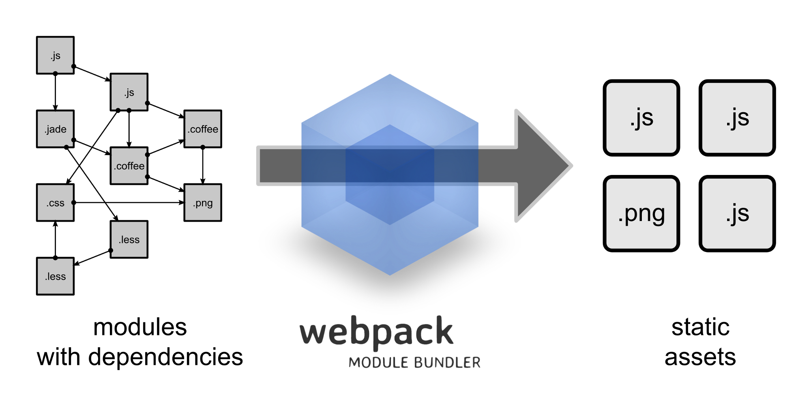
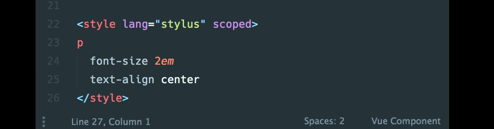

# Clase 4

## Planning del día 

1. Repaso clase anterior
2. Introducción a NodeJS
3. Introducción a Babel
4. Introducción a Webpack
5. Creación de proyectos y scaffoldings
6. Añadiendo funcionalidades extra a nuestro proyecto
7. Los Single File Components y vue-loader
8. Ejercicio "TODO LIST usando vue-cli y SFC"

## Índice

* [1. Introducción a NodeJS](#1.-Introducción-a-NodeJS)
    * [1.1. ¿Qué es?](#1.1.-¿Qué-es?)
    * [1.2. ¿Para qué se puede utilizar?](#1.2.-¿Para-qué-se-puede-utilizar?)
    * [1.3. ¿Para qué nos es útil en Vue?](#1.3.-¿Para-qué-nos-es-útil-en-Vue?)
    * [1.4. ¿Qué es NPM?](#1.4.-¿Qué-es-NPM?)
    * [1.5. ¿Cómo se instala NodeJS y NPM?](#1.5.-¿Cómo-se-instala-NodeJS-y-NPM?)
    * [1.6. ¿Cómo se usa NPM?](#1.6.-¿Cómo-se-usa-NPM?)
* [2. Introducción a Babel](#2.-Introducción-a-Babel)
    * [2.1. ¿Qué es?](#2.1.-¿Qué-es?)
    * [2.2. ¿Qué es ES6](#2.2.-¿Qué-es-ES6)
    * [2.3. Nuevas funcionalidades](#2.3.-Nuevas-funcionalidades)
        * [2.3.1. Importación/Exportación de módulos](#2.3.1.-Importación/Exportación-de-módulos)
        * [2.3.2. Destructurización](#2.3.2.-Destructurización)
        * [2.3.3. `fetch`](#2.3.3.-`fetch`)
        * [2.3.4. `let` y `const`](#2.3.4.-`let`-y-`const`)
        * [2.3.5. `async/await`](#2.3.5.-`async/await`)
* [3. Introducción a Webpack](#3.-Introducción-a-Webpack)
    * [3.1. ¿Qué es?](#3.1.-¿Qué-es?)
    * [3.2. ¿Cómo se utiliza?](#3.2.-¿Cómo-se-utiliza?)
    * [3.3. Diferentes partes de Webpack](#3.3.-Diferentes-partes-de-Webpack)
        * [3.3.1. `entry`](#3.3.1.-`entry`)
        * [3.3.2. `output`](#3.3.2.-`output`)
        * [3.3.3. `loader`](#3.3.3.-`loader`)
        * [3.3.4. `plugins`](#3.3.4.-`plugins`)
    * [3.4. Ejercicio "Montando tu primer scaffolding"]()
* [4. Introducción a Vue Cli](#4.-Introducción-a-Vue-Cli)
    * [4.1. ¿Qué es?](#4.1.-¿Qué-es?)
    * [4.2. Diferentes partes](#4.2.-Diferentes-partes)
    * [4.3. Instalación](#4.3.-Instalación)
    * [4.4. Creando un proyecto](#4.4.-Creando-un-proyecto)
    * [4.5. Añadiendo plugins](#4.5.-Añadiendo-plugins)
    * [4.6. Usando variables de entorno](#4.6.-Usando-variables-de-entorno)
    * [4.7. Usando Vue GUI](#4.7.-Usando-Vue-GUI)
* [5. Single File components](#5.-Single-File-components)
    * [5.1. Partes de un SFC](#5.1.-Partes-de-un-SFC)
    * [5.2. Indicando el lenguaje](#5.2.-Indicando-el-lenguaje)
    * [5.3. Indicando el ámbito del CSS](#5.3.-Indicando-el-ámbito-del-CSS)
* [6. Ejercicio "TODO LIST usando vue-cli y SFC"](#6.-Ejercicio-"TODO-LIST-usando-vue-cli-y-SFC")


# 1. Introducción a NodeJS

Una vez que hemos visto todo lo relativo a la librería de VueJS dedicada al renderizado de vistas. Vamos a dedica tiempo a cómo escalar nuestro proyecto para una aplicación mayor... pero para llegar a ello, necesitamos tener conceptos básicos de algunas tecnologías. Empecemos por NodeJS

## 1.1. ¿Qué es?

NodeJS es una tecnología que nos permite interpretar y ejecutar JavaScript en cualquier ordenador sin la necesidad de un navegador y con todas las herramientas (paquetes, librerías, APIS...) necesarias para poder obtener y almacenar los recursos de cualquier sistema en el que se encuentre.

NodeJS funciona gracias a la potencia del motor JavaScript v8 creado por Google, Open Source y que usa Google Chrome. 
    
## 1.2. ¿Para qué se puede utilizar?

A día de hoy. El poder ejecutar y tener acceso a los recursos de un ordenador por medio de JavaScript nos es muy útil por varias razones:

* Nos permite crear aplicaciones Web en el servidor: aplicaciones que pueden gestionar un número elevado de peticiones de manera asíncronas co grandes prestaciones de servicio.
* Nos permite realizar evaluaciones de ficheros JavaScript en nuestro propio terminal de comandos.
* Nos permite crear interfaces de lineas de comandos que extiendan las ya obtenidas por el sistema operativo.

## 1.3. ¿Para qué nos es útil en Vue?

Es este último uso el que nos es útil en VueJS. El equipo de VueJS ha creado un proyecto llamado vue-cli, desarrollado con NodeJS que nos permite crear scaffoldings de manera automática por medio de configuraciones. 

## 1.4. ¿Qué es NPM?

NPM son las siglas de node package manager. Es una herramienta web y de línea de comandos que nos permite instalar en nuestro sistema operativo o proyecto utilidades creadas en JavaScript y NodeJS. Es también un gestor de dependencias y una de las primeras herramientas con la que nos pelearemos al usar NodeJS.

## 1.5. ¿Cómo se instala NodeJS y NPM?

Para instalar NodeJS y NPM, lo mejor es ir a la página oficial de NodeJS y descargar la versión LTS del binario. Una vez que instalemos con el instalador (esto dependerá del sistema operativo que tengamos, es instalable tanto en Windows como en distro Linux o Mac), podremos comprobar si todo se ha instalado bien.

Abrammos una linea de comandos o terminal y ejecutemos la siguiente linea para ver si tenemos NodeJS instalado:

```sh
$ node -v
```

Esto nos indicará la versión de NodeJS instalada. Si ejecutamos lo siguiente:

```sh
$ npm -v
```

Nos indicará la versión de NPM instalada.

Si no estamos en las versiones más nuevas de NPM, instalemosla por medio del siguiente comando:

```sh
$ npm install -g npm
```

## 1.6. ¿Cómo se usa NPM?

Como decíamos, NPM nos va a servir para instalar dependencias o paquetes de NodeJS.

Dentro de la carpeta en la que deseemos montar un proyecto de NodeJS, abriremos una terminal y empezaremos a crear nuestra aplicación.

Para iniciar una aplicación, deberemos ejecutar el siguiente comando:

```sh
$ npm init
```

Este comando nos realizará una serie de preguntas que deberemos contestar. Al finalizar, nos generará un fichero llamado `package.json`. Este fichero json es un fichero de configuración y metainformación de nuestro proyecto. Un ejemplo de fichero `package.json` podría ser el siguiente:

```js
{
  "name": "curso_vue_fictizia",
  "version": "1.0.0",
  "description": "ejemplo de paquete de nodejs",
  "main": "index.js",
  "scripts": {
    "test": "echo \"Error: no test specified\" && exit 1"
  },
  "keywords": [
    "node",
    "vue",
    "curso",
    "fictizia"
  ],
  "author": "jdonsan",
  "license": "MIT"
}
```

Nos sirve para indicar el nombre, la descripción y versión de nuestro proyecto. Tambien nos va a servir para instalar dependencias.

Las dependencias de un proyecto de NodeJS se instalan en `node_modules`. Tenemos dos contextos donde poder instalarlas:

* A nivel global: nos sirve para guardar dependencias que usamos mucho y herramientas de línea de comandos.
* A nivel local: nos sirve para guardar las dependencias que usa un proyecto determinado y que no necesita compartir con el resto porque es de uso específico.

Para instalar estas dependencias, lo haríamos de esta manera. Si quisieramos instalar VueJS en nuestro proyecto. Lo haríamos de manera local. Sería así:

```sh 
$ npm install vue --save
```

Es decir instálame `vue` de manera local y como una dependencia que necesito en producción. 

Podemos instalar dependencias que solo se usarán en tiempo de desarrollo. `webpack` va a ser una de estas herramientas. Para instalarla. hacemos lo siguiente:

```sh
$ npm install webpack --save-dev
```

Lo único que cambia con la anterior es el flag del final.

Ahora bien, para instalar `vue-cli` que voy a hacer usos de ella en muchos proyectos diferentes, lo haría de manera global y esto se haría así:

```sh
$ npm install @vue/cli -g
```

El flag `g` (de global), nos permite esto.

Para desinstalar dependencias, se usaría `uninstall` y nos funcionaría todos los flags que hemos indicado anteriormente.


# 2. Introducción a Babel
    
## 2.1. ¿Qué es?

* Es un preprocesador JavaScript
* Nos permite escribir código ES6 para navegadores que solo soportan ES5.
* Podemos añadirlo en nuestros proyecto y hará que nuestro código funcione con las nuevas funcionalidades en cualquier navegador.
    
## 2.2. ¿Qué es ES6?

* Es la nueva especificación de EcmaScript.
* EcmaScript es la especificiación estándar en las que se basan las implementaciones de JavaScript de todos los navegadores y motores JavaScript modernos del momento.
* Las nuevas funcionalidades de ES6 nos van a permitir un mejor código JavaScript. Más limpio y elegante. Nos va a permitir organizar nuestro código mejor.
* Todas las funcionalidades que encontramos en ES6 ya estbana disponibles en ES5. Simplemente nos aporta azucar sintáctico.

## 2.3. Nuevas funcionalidades

Vue usa muchos patrones que se apoyan de las nuevas funcionalidades de JavaScript. Para entender mejor el código en las próximas lecciones, vamos a explicar algunas que nos serán útiles. No son todas, pero si son algunas de las más importantes.
    
### 2.3.1. Importación/Exportación de módulos

Una de las funcionalidades que más usaremos estos días en el curso será la importación y exportación de módulos. Hasta la existencia de ES6, hemos intentado organizar nuestro código de manera simple en diferentes módulos.

Esto nos ha sido complicado ya que JS no contaba con un gestor de módulos de manera nativa. Hemos creado patrones y sistemas para poder hacerlo, pero siempre de una forma arcaica y teniendo que dedicar mucho tiempo a código fontanería.

NodeJS implementó un sistema gestor de módulos basados en las buenas prácticas de la comunidad que nos ayuó mucho, pero el verdadero avance ha sido que por fin podamos separar funcionalidad de una manera cómoda de manera nativa más el uso de herramientas de empaquetado como Webpack (que explicaremos en un momento).

Empecemos por saber qué es exportar. En un módulo JavaScript, todo lo declarado es por defecto de naturaleza privada. Esto quiere decir que cuando cargamos y ejecutamos un módulo, se crea un contexto específico al que no es posible acceder si no usamos la palabra reservada  `export`. Tenemos dos maneras de hacer accesible funcionalidad en un módulo:

* Usando exports con nombre:

En el módulo, podremos usar el siguiente código:

```js
// module "my-module.js"
function cube(x) {
  return x * x * x;
}
const foo = Math.PI + Math.SQRT2;
var graph = {
    options:{
        color:'white',
        thickness:'2px'
    },
    draw: function(){
        console.log('From graph draw function');
    }
}
export { cube, foo, graph };
```

De esta forma, en otro script, podemos importar lo que necesitamos de la siguiente forma:

```js
//script demo.js
import { cube, foo, graph } from 'my-module';
graph.options = {
    color:'blue',
    thickness:'3px'
}; 
graph.draw();
console.log(cube(3)); // 27
console.log(foo);    // 4.555806215962888
```

* Usando el export por defecto:

Si queremos exportar un sólo valor o tener uno por defecto para nuestro módulo, podemos usar un export por defecto:

```js
// module "my-module.js"
export default function cube(x) {
  return x * x * x;
}
```

De esta forma la importación de un export default será sumamemte sencilla:

```js
import cube from 'my-module';
console.log(cube(3)); // 27
```

### 2.3.2. Destructurización

La sintaxis de destructuring assignment es una expresión de JavaScript que hace posible la extracción de datos de arreglos u objetos usando una sintaxis que equivale a la construcción de arreglos y objetos literales.

```js
[a, b] = [1, 2]
[a, b, ...rest] = [1, 2, 3, 4, 5]
{ a, b } = { a: 1, b: 2 }
{ a, b, ...rest } = { a: 1, b: 2, c: 3, d: 4 } 
```

* Ejemplos con arrays

```js
var foo = ["uno", "dos", "tres"];

// sin destructuración
var uno  = foo[0];
var dos  = foo[1];
var tres = foo[2]; // asignación en tres lineas

// con destructuración
var [uno, dos, tres] = foo; // asignación en una sola linea
```

* Cambiando orden de las variables:

```js
var a = 1;
var b = 3;

[a, b] = [b, a];
```

* Multiples valores de retorno:

```js
function f() {
  return [1, 2];
}

var a, b;
[a, b] = f();

console.log("A es " + a + " B es " + b);
```

* Ignorando algunos valores de retorno:

```js
function f() {
  return [1, 2, 3];
}

var [a, , b] = f();
console.log("A es " + a + " B es " + b);
```
* Ejemplos con objetos:

```js
var o = {p: 42, q: true};
var {p, q} = o;

console.log(p); // 42
console.log(q); // true 

// Asigna nuevos nombres de variable
var {p: foo, q: bar} = o;

console.log(foo); // 42
console.log(bar); // true  
```
    
### 2.3.3. `fetch`

Hemos estado haciendo uso de `axios` para realizar llamadas asíncronas a servidor por medio de JavaScript. Sin embargo, ES6 ya cuenta con una API más sencilla para realizar este tipo de llamadas. De esta manera evitamos tener dependencias de terceros. 

Un ejemplo de uso es el siguiente:

```js
fetch('http://example.com/movies.json')
  .then(function(response) {
    return response.json();
  })
  .then(function(myJson) {
    console.log(myJson);
  });
```
        
### 2.3.4. `let` y `const`

En JS antes de ES6 una variable podía tener dos contextos: contexto global y contexto función. Esto es que si una variable se definía en el contexto global, cualquier bloque o función podría acceder a ella. 

El contexto función implica que una variable definida dentro de una función solo puede ser accedida dentro de esa función, de las funciones definidas dentro de esa función y de los bloques de la misma.

Hasta la entrada de ES6 no existía el contexto de bloque. Para conseguir este contexto, utiliza `let` para definir una variable:

```js
function varTest() {
  var x = 31;
  if (true) {
    var x = 71;  // ¡misma variable!
    console.log(x);  // 71
  }
  console.log(x);  // 71
}

function letTest() {
  let x = 31;
  if (true) {
    let x = 71;  // variable diferente
    console.log(x);  // 71
  }
  console.log(x);  // 31
}
// llamamos a las funciones
varTest();
letTest();
```
Por otro lado, ahora en JS, podemos definir variables de solo lectura por medio de `const`:

```js
// NOTA: Las constantes pueden ser declaradas en mayusculas o minusculaas,
//pero por convencion para distinguirlas del resto de variables se escribe todo en mayusculas

// definimos MY_FAV como constante y le damos un valor de 7
const MY_FAV = 7;

// lanzara un error: Unkeught TypeError: Asignación a variable constante.
MY_FAV = 20;

// imprimira 7
console.log('my favorite number is: ' + MY_FAV);

// lanzara un error: SyntaxError: tratando de redeclarar una constante. El identificador 'MY_FAV' ya ha sido declarado
const MY_FAV = 20;

// el nombre MY_FAV esta reservado para la constante anterior, también fallara y lanzara un SyntaxError por la redeclaración
var MY_FAV = 20;

// el nombre MY_FAV esta reservado para la variable anterior, esto también lanzara un SyntaxError por la redeclaración
let MY_FAV = 20;

// es importante tener en cuenta como funciona el alcance de bloque
if (MY_FAV === 7) { 
    // esto esta bien y crea una variable MY_FAV de alcance/ambito de bloque
    // (funciona igual de bien con let para declarar un alcance de bloque/ambito de variable no-constante)
    const MY_FAV = 20;

    // MY_FAV ahora es 20
    console.log('my favorite number is ' + MY_FAV);

    // aquín también lanzara un SyntaxError por la redeclaración 
    var MY_FAV = 20;
}

// MY_FAV todavia es 7
console.log('my favorite number is ' + MY_FAV);

// lanza error, falta el inicializador en la declaracion de const
const FOO; 

// const tambien funciona en objetos
const MY_OBJECT = {'key': 'value'};

// Intentando sobrescribir el objeto nos lanza un error
MY_OBJECT = {'OTHER_KEY': 'value'};

// Sin embargo, los object keys no estan protegidas,
// por lo que la siguiente sentencia se ejecutara sin problema
MY_OBJECT.key = 'otherValue'; // Use Object.freeze() para hacer un objeto inmutable

// Lo mismo se aplica a los arrays
const MY_ARRAY = [];
// es posible empujar elementos en el array
MY_ARRAY.push('A'); // ["A"]
// Sin embargo, asignar un nuevo array a la variable lanza error
MY_ARRAY = ['B']
```
    
### 2.3.5. `async/await`

Las funciones asíncronas es otro sistema de gestionar la asincronía en JavaScript. Evitamos el modelo funcional de la gestión de asincronía por promesas y nos vamos a un modelo imperativo.

Las llamadas `async function` nos ayudan a escribir un código más legible y más fácil de seguir en cuanto a flujo.

Tenemos la siguiente función que sabemos que generará un problema de asincronía por tener un `setTimeout` y ser gestionada por una promesa:

```js
function resolveAfter2Seconds() {
  return new Promise(resolve => {
    setTimeout(() => {
      resolve('resolved');
    }, 2000);
  });
}
```

En el modelo tradicional, si quisieramos el resultado obtenido en `setTimeout`, lo gestionaríamos por medio de otra promesa. Lo haríamos de esta manera:

```js
function promiseCall() {
  console.log('calling');
  resolveAfter2Seconds().then(result => {
    console.log(result)
  });
}

promiseCall();
```

Este modelos se simplifica con `async/await`. Simplemente indicamos que esta función hará gestión d euna asncronía con `async` y diremos dónde debemos esperar con `await`:

```js
async function asyncCall() {
  console.log('calling');
  var result = await resolveAfter2Seconds();
  console.log(result);
  // expected output: 'resolved'
}

asyncCall();
```

De esta manera es más legible ¿verdad?

## 2.3.6. Arrow function

Ahora podemos definir funciones de tipo flecha para evitar sintaxis innecesaria:

```js
const helloWorld = () => console.log('Hello!!')
helloWorld()
```

Esto es equivalente a esto:

```js
const helloWorld = function () {
  console.log('Hello!!')
}
helloWolrd()
```

Lo bueno de las `arrow function` es que enlaza el contexto:

```js
function Persona(){
  this.edad = 0;

  setInterval(() => {
    this.edad++; // |this| apunta al objeto Persona
  }, 1000);
}

var p = new Persona();`
```

Se acabó lo de cachear el contexto para poder usarlo en una función asíncrona:

```js
function Persona() {
  var self = this; 
  self.edad = 0;

  setInterval(function crecer() {
    self.edad++;
  }, 1000);
}
```

# 3. Introducción a Webpack
    
## 3.1. ¿Qué es?

Es una herramienta de NodeJS que nos permite empaquetar todos los recursos de nuestros proyecto. El dibujo dej bastante claro el comportamiento:



Dado un proyecto con ficheros que tienen dependencias los unos con los otros, Webpack, consigue recorres este grafo y sacar paquetes de los estáticos impresindibles ya sea JS, CSS o HTML.

## 3.2. ¿Cómo se utiliza?

Con un proyecto de Node iniciado:

```sh
npm init
```

Instalamos las dependencias necesarias en nuestro proyecto. En este caso `webpack` y `webpack-cli`

```sh 
$ npm install webpack webpack-cli --save-dev
```

Ahora lo que vamos a crear es una estructura de proyecto que Webpack entienda. En este caso el siguiente:

```sh
  03-webpack
  |- package.json
  |- /dist
    |- index.html
  |- /src
    |- index.js
```

Para ver el funcionamiento incluímos en `src/index.js` el siguiente código:

```js
  import _ from 'lodash';

  function component() {
    let element = document.createElement('div');

    element.innerHTML = _.join(['Hello', 'webpack'], ' ');

    return element;
  }

  document.body.appendChild(component());
```

Es un fichero js que carga un 'Hello World' usando como dependencia `lodash`. Webpack se tendrá que hacer un paquete que incluya nuestro fichero y la librería `lodash`.

Para ello, tenemos que instalar `lodash` en el proyecto de la siguiente manera:

```sh
$ npm install lodash --save
```

Ahora en el `index.html` escribimos lo siguiente:

```html
  <!doctype html>
  <html>
   <head>
     <title>Getting Started</title>
   </head>
   <body>
     <script src="main.js"></script>
   </body>
  </html>
```

`main.js` es el fichero de empaquetado que generará webpack en la carpeta `/dist` por defecto.

Si ejecutamos en un terminal `npx webpack` se nos generará el fichero `main.js` nedesario para que todo funcione.

Y ya esta! Todo se empaqueta como debería.

Hay veces que esta configuración se nos quedará corta. Para crear una configuración personalizada, tenemos que incluir un fichero llamado `webpack.config.js`.

Expliquemos las diferentes partes de este fichero:

## 3.3. Diferentes partes de Webpack

Hay 4 partes que tenemos que diferenciar en un fichero de configuración de Webpack. Son las siguientes:
        
### 3.3.1. `entry`

Es el espacio dedicado para indicar a webpack dónde empieza nuestra aplicación y desde dónde tiene que empezar a empaquetar.

Un ejemplo es este

```js
// webpack.config.js
module.exports = {
  entry: './src/index.js'
};
```
Que nos permite realizar lo mismo que hicimos en el ejercicio anterior. Empezar a empaquetar por `src/index.js`

Esta forma de escribirlo es igual que esta:

```js
module.exports = {
  entry: {
    main: './path/to/my/entry/file.js'
  }
};
```
Esta forma nos permite dar un nombre al paquete que se va a genenar. En este caso este paquete se llamará `main`.

Podemos generar varios puntos de entrada para que se generen varios paquetes que tengan diferente nombre. En este siguiente se generará un paquete con nombre `app` y otro con nombre `adminApp`:

 ```js
 module.exports = {
  entry: {
    app: './src/app.js',
    adminApp: './src/adminApp.js'
  }
};
```

Esto nos puede ser muy útil para generar un paquete de cada una de las páginas de nuestra web, por ejemplo: 

```js
// webpack.config.js

module.exports = {
  entry: {
    pageOne: './src/pageOne/index.js',
    pageTwo: './src/pageTwo/index.js',
    pageThree: './src/pageThree/index.js'
  }
};
```

### 3.3.2. `output`

Por otra parte podemos decir dónde se tienen que guardar los paquetes que hemos generado:

Con esta configuración indicamos que el paquete tiene que llamarse `bundle.js`:

```js
module.exports = {
  output: {
    filename: 'bundle.js',
  }
};
```

Si tenemos más de una entrada, podemos generar un patrón para que nos genere diferentes salidas. Por ejemplo, el siguiente código con la expresión regular `[name]` nos genera dos ficheros en la carpeta `/dist` (indicado con `output.path`) con los nombre `app.js` y `search.js`:

```js
module.exports = {
  entry: {
    app: './src/app.js',
    search: './src/search.js'
  },
  output: {
    filename: '[name].js',
    path: __dirname + '/dist'
  }
};

// escribe en disco: ./dist/app.js, ./dist/search.js
```


### 3.3.3. `loader`

Los loader son transformaciones que son aplicadad en el código de un módulo. Esto nos permite preprocesar ficheros antes de importarlos o "cargarlos". Los loader son considerados como 'ateras en otras herramientas de construcción y proporcionan poderosas maneras de manejar las diferentes etapas de construcción de un proyecto front. 

Los loader pueden transformar ficheros desde diferentes lenguajes (como TypeScript) a JavaScript o convertir imagenes en data url inline. Los loader incluso nos permite hacer comosas como importar ficheros CSS directamente en módulos de JavaScript.

Veamos un ejemplo:

Por ejemplo, podems usar loader para decirle a webpack que carte los ficheros CSS o convertir TypeScript a JavaScript. Para hacer esto, empezaríamos por instalar los loaders que necesitamos:

```sh
$ npm install --save-dev css-loader
$ npm install --save-dev ts-loader
```

Y entonces le decimos a webpack a usar `css-loader` para todos los ficheros `.css` y el `ts-loader` para todos los ficheros `.ts`:

```js
module.exports = {
  module: {
    rules: [
      { test: /\.css$/, use: 'css-loader' },
      { test: /\.ts$/, use: 'ts-loader' }
    ]
  }
};
```

### 3.3.4. `plugins`

Si el comportamiento de Webpack no es suficiente, cuenta con un sistema de plugins que nos permite incluirle funcionalidad extra. No vamos a crear plugins, pero sí a usarlos.

Por ejelplo en este caso, hacemos uso del plugin `html-webpack-plugin` que nos permite realizar acciones sobre los htmls d enuestra aplicación:

```js
const HtmlWebpackPlugin = require('html-webpack-plugin'); //instalado via npm
const webpack = require('webpack');
const path = require('path');

module.exports = {
  entry: './path/to/my/entry/file.js',
  output: {
    filename: 'my-first-webpack.bundle.js',
    path: path.resolve(__dirname, 'dist')
  },
  module: {
    rules: [
      {
        test: /\.(js|jsx)$/,
        use: 'babel-loader'
      }
    ]
  },
  plugins: [
    new webpack.ProgressPlugin(),
    new HtmlWebpackPlugin({template: './src/index.html'})
  ]
};
```

## 3.4. Ejercicio "Montando tu primer scaffolding"

* Vamos a crear un proyecto que tenga la siguiente estructura:

```sh
|- /my-project
   |- /dist
      |- app.min.js
      |- app.min.css
      |- index.html
   |- /src
      |- /components
        |- /HelloWorld
           |- index.js
           |- style.scss
      |- App.js
      |- main.js
   |- webpack.config.js
   |- package.json
```

# 4. Introducción a Vue Cli

## 4.1. ¿Qué es?

`vue-cli` es un sistema para construir aplicaciones VueJS de una manera rápida. Nos proporciona:

* Una forma de crear scaffoldings de una manera rápida y sencilla.
* La posibilidad de crear prototipos con cero configuración.
* Una colcección de plugins oficiales que integran las mejores herramientas del ecosistema front.
* Un sistema gráfico para gestionar todos tus proyectos hechos en VueJS.

## 4.2. Diferentes partes

* **Cli**: Es el paquete instalado globalmente y proporciona los comandos de terminal de vue. Proporciona la habilidad de crear nuevos scaffoldings. Tambien puedes gestionar tus proyectos de manera gráfica.
* **Cli Service**: Es una dependencia de desarrollo. Es un paquete que se instala localmente en todo proyecto que se crea con `vue-cli`. Este servicio es el encargado de construir la configuración de Webpack por nosotros.
* **Cli Plugins**: Son paquetes que proporciona funcionalidades opcionales a nuestro `vue-cli` como pueda ser: incluir Babel o TypeScript o integración con ESlin, test unitarios o test e2e.

## 4.3. Instalación

Previamente necesitamos tener instalado NodeJS y NPM. Después, instalamos `vue-cli` con el terminal:

```sh
$ npm install -g @vue/cli
```

Para ver si está bien instalado, ejecutamos:

```sh
$ vue --version`
```

## 4.4. Creando un proyecto

Para crear un proyecto a partir de `vue-cli`, ejecutaremos: 

```sh
$ vue create hello-world
```

Donde `hello-world` es el nombre de nuestro proyecto. Este comando nos preguntarán si queremos una configuración por defecto, una que tengamos guardada o una nueva configuración:


Si decidimos que queremos una configuración nueva. Tendremos que seleccionar qué necesitamos:


Cuando terminemos, se nos generará una estructura de ficheros lista para poder a empezar a trabajar con VueJS.

## 4.5. Añadiendo plugins

Para añadir un plugin en un proyecto ya creado, ejecutaremos el siguiente comando:

```sh
$ vue add @vue/eslint
```

Esto añadiría el plugin de `eslint` dentro de nuestro proyecto.

## 4.6. Usando variables de entorno

Podemos indicar variables locales para configurar nuestra aplicación. Para incluir estas variables añadimos alguno de estos ficheros en la raíz del proyecto:

```sh
.env                
.env.local        
.env.[mode]        
.env.[mode].local 
```

`mode` indica el entorno en el que se tienen que usar esas variables de configuración por lo general `development`, `production` o `test`.

Esos ficheros internamente tienen este formato:

```sh
FOO=bar
VUE_APP_SECRET=secret
```

Todas las variables que tengan el prefijo `VUE_APP_` serán nacesarias en tiempo de ejecución de la aplicación. Un claro ejemplo puede ser:

```sh
VUE_APP_URL_API=https://api.fictizia.con
```

Esta variable se usará para hacer llamadas a nuestra API cuando se ejecute en el navegador la APP.

## 4.7. Usando Vue GUI

Si deseas crear y gestionar tus dependencias por medio de interfaz gráfica, tendremos que ejecutar el siguiente comando:

```sh
$ vue ui
```

Y nos aparecerá algo como esto:


# 5. Single File components

Cuando usamos vue-cli, los componentes se desarrollan en fichero `.vue` y contienen todo el código necesario para funcionar (HTML, CSS y JS). Es lo que se conoce como Single File Component o SFC.

Tiene ese formato


No te preocupes por estos fichero si te parecen raros!!

1. Cumplen bien la separación de conceptos. No se entremezcla estilos con logica ni con estructura.
2. Estos ficheros son descompuestos con Webpack y el loader `vue-loader` en tiempo de construcción. Este loader sabe cómo empaquetar cada parte en su lugar determinado para que cuando quieras llevar tu aplicación a un servidor todo esté en su sitio.
3. Si no te convence trabajar así, puedes seguir trabajando en ficheros separados (a la larga se vuelve tedioso).

## 5.1. Partes de un SFC

Un fichero SFC se compone de tres partes:

* template: donde incluímos el nodo raíz (recuerda esto) de templates que queremos que vue renderice con los datos.
* script: Toda la instancia JS de nuestro componente. Recuerda añadir un `name` al componente y no poner ya `template`.
* styles: estilos CSS que necesite tener tu componente.

## 5.2. Indicando el lenguaje

VUe se interelaciona con otras herramientas y gracias a Webpack vas a poder usar tus herramientas favoritas. Por ejemplo si usas `jade/pug` para crear tus template, sigue usandolo. Simplemente añada la etiqueta `lang` y el motor de templating que vas a querer ejecutar.

Hazlo de esta manera:


Con CSS nos pasa igual. Usa CSS, SASS, LESS o Stylus.

Lo bueno de esto es que cada componente puede usar el lenguaje que más te convenga en cada momento que Vue sabrá trabajar con él y los componentes sabrán comunicarse perfectamente entre ellos.

## 5.3. Indicando el ámbito del CSS

Podemos hacer que el CSS de un componente solo se repercuta en el HTML del componente. Para hacer esto tenemos que indicar el atributo `scoped` y ese CSS solo será accedido por el componente.



## 6. Ejercicio "TODO LIST usando vue-cli y SFC"

Condiciones:
* Full Component
* Tiene que tener un header y un footer
* Se tiene que hacer con vue-cli y SFC


    