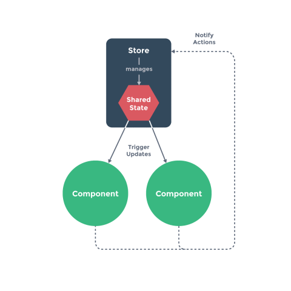

# Clase 6

## Planning del día 

1. Repaso clase anterior
2. Creando un gestor de estados simple
3. vuex
4. Ejercicio 

## Índice

- [1. Introducción](#1-introducción)
  - [1.1. ¿Qué es el estado de una aplicación?](#11-¿qué-es-el-estado-de-una-aplicación)
  - [1.2. ¿Qué son las acciones de una aplicación?](#12-¿qué-son-las-acciones-de-una-aplicación)
- [2. ¿Cómo puedo comunicarme entre componentes?](#2-¿cómo-puedo-comunicarme-entre-componentes)
- [3. ¿Qué es vuex?](#3-¿qué-es-vuex)   
  - [3.1. ¿Cómo empezamos con vuex?](#31-¿cómo-empezamos-con-vuex)    
  - [3.2. ¿Cómo empezar?](#32-¿cómo-empezar)   
  - [3.3. `State`](#33-state)      
    - [3.3.1. Árbol simple de estados](#331-árbol-simple-de-estados)    
    - [3.3.2. Obteniendo el estado en un componente](#332-obteniendo-el-estado-en-un-componente)       
    - [3.3.3. `mapState`](#333-mapstate)      
    - [3.3.4. Spread Operator](#334-spread-operator)        
    - [3.3.5. El componente aun puede tener estado local](#335-el-componente-aun-puede-tener-estado-local)   
  - [3.4. `Getters`](#34-getters)       
    - [3.4.1. Acceso como propiedades](#341-acceso-como-propiedades)     
    - [3.5.2. Acceso como métodos](#352-acceso-como-métodos)    
    - [3.5.3. `mapGetters`](#353-mapgetters)   
  - [3.6. `Mutations`](#36-mutations)       
    - [3.6.1. Commit con payload](#361-commit-con-payload)       
    - [3.6.2. Mutación como objeto](#362-mutación-como-objeto)    
    - [3.6.3. Las mutaciones siguen las reglas de reactividad](#363-las-mutaciones-siguen-las-reglas-de-reactividad)    
    - [3.6.4. Usando constantes para los tipos de mutaciones](#364-usando-constantes-para-los-tipos-de-mutaciones)   
    - [3.6.5. Las mutaciones deben ser sincronas](#365-las-mutaciones-deben-ser-sincronas)     
    - [3.6.6. `mapMutations`](#366-mapmutations)    
  - [3.7. `Actions`](#37-actions)     
    - [3.7.1. Ejecutando acciones](#371-ejecutando-acciones)     
    - [3.7.2. `mapActions`](#372-mapactions)       
    - [3.7.3. Componiendo acciones](#373-componiendo-acciones)   
  - [3.8. Módulos](#38-módulos)     
    - [3.8.1. Estado en un módulo](#381-estado-en-un-módulo)     
    - [3.8.2. Espacio de nombres](#382-espacio-de-nombres)    
  - [3.9. Estructura de aplicación](#39-estructura-de-aplicación)


# 1. Introducción

Cuando decidimos apostar por una arquitectura de componentes, una de los primeros problemas con los que nos enfrentamos, cuando nuestra aplicación empieza a crecer, es la dificultad que solemos tener para comunicar componentes que se encuentran a distintos niveles de nuestro árbol.

Una vez que hemos tratado el problema de diseñar buenos componentes, que hemos hablado de cómo dividir nuestra aplicación en diferentes vistas de las que podemos navegar sin problema, llega el turno de cómo gestionar el estado interno de una aplicación de página única.

Ahoras, hablaremos de cómo atajar este problema dentro del ecosistema de vue.

## 1.1. ¿Qué es el estado de una aplicación?

Cuando hablamos de estados en una aplicación, hablamos del conjunto completo de variables y constantes que configuran nuestra aplicación. Los estados son todas las formas posibles en las que se puede encontrar mi sistema en un momento determinado.

La forma en que gestionemos y estructuremos el estado de nuestra aplicación puede ser la clave para evitar bugs innecesarios. Saber cómo, cuándo, dónde y por qué muta un estado en particular y de la manera más rápida posible, nos ayudará en nuestro día a día.

## 1.2. ¿Qué son las acciones de una aplicación?

Son todos aquellos métodos, funciones, o procedimientos que se encargan de mutar los estados de nuestra aplicación. Se encargan de que dado x este pueda crear un nuevo estado y. La definición matemática de una función es este:

```js
f(x) = y
```

Dado un estado x que es pasado a una función f es obtenido el nuevo estado y. Los paradigmas de programación se articulan como propuestas para gestionar y mutar los estados por medios de diferentes tipos de cómputos.


# 2. ¿Cómo puedo comunicarme entre componentes?

Al trabajar con arquitecturas de componentes jerarquizadas en forma de árbol, uno de nuestros trabajos consta de conseguir comunicar estados de unos componentes a otros. Cuando empezamos a desarrollar nuestro árbol, nuestras arquitecturas son sencillas y el comunicar componentes padres con componentes hijos es relativamente fácil.

El problema viene cuando nuestro árbol empieza a crecer y tenemos que comunicar componentes hermanos – componentes que comparten el mismo componente que los instanció – o componentes que no tienen ningún parentesco dentro de nuestro árbol.

Cuando ocurre esto, tenemos que empezar a pensar en alguna estrategia que nos sea útil y fácilmente de mantener. Una de estas estrategias nos la proporciona la propia librería de vue. En vue podemos comunicar diferentes componentes creando un bus de datos interno.

Este bus de datos se consigue creando una nueva instancia de la clase Vue. Yo por ejemplo, podría hacer esto para comunicar dos componentes sin parentesco:

```js
const bus = new Vue();

const componentA = {
  methods: {
      doAction() {
        bus.$emit('increment', 1);
      }
  }
};

const componentB = {
  data() {
    return {
      count: 0
    }
  },
  created() {
    bus.$on('increment', (num) => {
      this.count += num;
    });
  }
};
```

Lo que hago es crear una instancia de Vue que cuenta con un método $emit para emitir eventos y un método $on para registrarme a eventos. Con esto, lo que hago es, en el componente B, registrarme al evento increment cuando el componente ya ha sido creado y esperar a que el componente A emita nuevos cambios al ejecutar su método doAction. Es muy parecido a la comunicación que tiene un hijo con un padre, pero esta vez sin parentesco.

Este sistema nos puede funcionar puntualmente para aplicaciones pequeñas o en casos aislados. Cuando no sistema empieza a crecer, empieza a hacerse inmantenible este sistema. Nos dificulta las labores de reutilizar acciones y de compartir estados comunes, por tanto, tenemos que buscar otras alternativas.

Podría ser buena idea, para aplicaciones medias, hacer uso de un un lugar centralizado donde compartir estos estados y métodos. Una pequeña librería que usen los componentes. Podríamos pensar en algo como esto:

```js
var store = {
  debug: true,

  state: {
    message: 'Hello!'
  },

  setMessageAction (newValue) {
    this.debug && console.log('setMessageAction triggered with', newValue)
    this.state.message = newValue
  },

  clearMessageAction () {
    this.debug && console.log('clearMessageAction triggered')
    this.state.message = ''
  }
};

var vmA = new Vue({
  data: {
    privateState: {},
    sharedState: store.state
  }
});

var vmB = new Vue({
  data: {
    privateState: {},
    sharedState: store.state
  }
});
```

Lo que hacemos es crear un objeto que contiene el estado a compartir y unos métodos que se encargan de mutar este estado. De esta manera centralizamos los estados y las acciones.

Ahora, podemos crear estancias de componentes que compartan parte del estado. Si uno de los componentes quieren mutar un estado compartido, hacen uso de uno de los métodos del store. Cómo el objeto se encuentra reverenciado en todos los componentes que deseamos, el cambio se realiza en todos.

Con esto, conseguiríamos una arquitectura muy parecida a la del siguiente dibujo:




Como decimos, este sistema nos puede funcionar, pero cuando contamos con aplicaciones más grandes aún, donde modularizar también este store será necesario, necesitaremos una librería más elaborada, más robusta y que no de tantas posibilidades para manipular externamente el estado. Es aquí donde entra en juego alternativas como vuex.

# 3. ¿Qué es vuex?

Cuando el ejemplo anterior se nos queda demasiado corto, es hora de incluir a nuestra aplicación de vue una alternativa llamada vuex. vuex es la implementación que ha hecho la comunidad del patrón de diseño creado por Facebook llamado flux.

Cuando llega ese momento en que tienes que compartir demasiado estados comunes entre componentes, que tienes que hacer virguerías para comunicarte en tu propia comunidad, que tienes métodos o acciones muy parecidas en muchos componentes que te gustaría refactorizar o que empiezas a tener problemas para seguir la trazabilidad por la que pasa un estado en particular es momento de plantearse usar este tipo de arquitecturas.

flux es una arquitectura que gestiona el estado en un objeto singleton global donde su labor es crear mecanismos para evitar que otros componentes puedan cambiar el estado de una aplicación sin su control.

Dentro de la comunidad se han desarrollado muchas implementaciones de flux, pero una de las más conocidas es redux. redux es una librería, de estilo funcional, muy utilizada por ser agnóstica al frameworks.

Esto quiere decir, que la librería puede ser utilizada tanto con Angular como con React sin sufrir fricciones con los diferentes planteamientos ya que se encarga de la gestión de forma que no se acopla con ninguna plataforma. Siempre necesitaremos conectores específicos para usarlo con cada una de ellas. En vue también se cuenta con un conector para redux, por si los desarrolladores desean hacer uso de él.

Sin embargo, como decíamos, en vue se  ha optado por desarrollar una implementación específica del patrón llamada vuex y que se acopla mucho mejor a la filosofía de vue como iremos viendo a lo largo de estos posts.

La arquitectura de vuex está muy bien esquematizada en esta imagen:


Aunque entraremos en detalle más adelante, expliquemos cada elemento:

* El cuadro verde representa nuestra arquitectura de componentes. Los cuales se presentan ahora como la estructura de un edificio esperando a estar habitado por los estados de la aplicación.

* El círculo morado son estos estados que los componentes usan. No se encuentran internamente dentro de los componentes, sino que ahora están gestionados por vuex y vinculados a los componentes por medio de observadores. vuex se adecua muy bien al sistema reactivo de la plataforma y lo que hace es, que cuando un estado dentro de su sistema de almacenamiento muta, y se encuentra vinculado con un componente, se provoca la reacción de renderizar de nuevo el componente con el nuevo estado mutado.

* Por otra parte, los componentes son capaces de lanzar acciones. Las acciones son el círculo amarillo y son un buen sitio donde gestionar parte de la lógica más próxima a los datos de nuestra aplicación. Permiten gestionar asincronía, por lo que son el lugar idóneo para realizar llamadas a servidores externos (caja gris).

* Cuando una acción ha terminado de realizar sus labores asíncronas (o síncronas), permite realizar confirmaciones (commits) contra el estado.
Estas confirmaciones, lo que provocan son ejecutar métodos especializados en la mutación de cambios. Esto se puede ver en el círculo rojo. Cuando se ejecuta estos métodos de mutación se desencadenan cambios en el estado que provocan renderizados en el HTML. De esta manera, cerramos el círculo.

Si nos fijamos, nos encontramos en un flujo unidireccional, lo que nos ayuda a entender en todo momento qué es lo que está ocurriendo en nuestro sistema.
Por ahora dejemos esto aquí, en el marco teórico, porque lo explicaremos con ejemplos más adelante. Ahora veamos como integrar la librería de vuex en nuestro SPA.

## 3.1. ¿Cómo empezamos con vuex?

Bastante simple. Como todo en el mundo NodeJS, lo primero que hacemos es instalar e incluir la dependencia en nuestra aplicación de la siguiente manera:

```bash
$ npm install vuex --save
```

Como vue-cli no nos da soporte para vuex en su generador, lo siguiente será incluir la carpeta donde almacenaremos todo lo necesario para vuex. Lo hacemos de esta manera:

Captura de pantalla de 2017-05-24 12-31-06.png

Dentro de este index.js crearemos todo nuestro almacenamiento de estados. Lo primero que escribimos es lo siguiente:

```js
import Vue from 'vue';
import Vuex from 'vuex';

Vue.use(Vuex);

export default new Vuex.Store({});
```

Donde, como siempre en vue, estamos añadiendo vuex como un plugin, como ya hacíamos con vue-router.

Lo último que hacemos para acabar con la conexión total entre vue y vuex, es incluir la instancia creada del store en la instancia de nuestra aplicación, de la siguiente manera:

```
import Vue from 'vue';
import App from './components/app/app.vue';
import store from './store';


const app = new Vue({
    el: '#app',
    store,
    template: '<App/>',
    components: { App }
});
```

Ya está, ya podemos empezar con el resto de conceptos.


## 3.2. ¿Cómo empezar?

```js
const store = new Vuex.Store({
  state: {
    count: 0
  },

  mutations: {
    increment (state) {
      state.count++
    }
  }
})
```

```js
store.commit('increment')

console.log(store.state.count) // -> 1
```

## 3.3. `State`

### 3.3.1. Árbol simple de estados

Vuex usa un arbol simple de estados. Esto significa que en único objeto, gestionamos todos los datos a nivel de plaicación. Nos ayuda a tener un úncio origen de la verdad dentro de nuestra aplicación. 

Esto significa que generalmente solo tendremos un unico store por aplicación. Tener un sistema así, nos va a permitir realizar fotografías de un momento determinado de la aplicación lo que nos permitirá depurar mejor nuestras aplicaciones.

### 3.3.2. Obteniendo el estado en un componente

Como indicábamos anteriormente, para crear un contenedor de datos en Vuex o Store, haremos lo siguiente:

```js
const store = new Vuex.Store({
  state: {
    count: 0
  }
})
```
De esta manera, ya tenemos un objeto controlado, desde donde podemos acceder desde los componentes.

Para hacer un acceso desde un componente, es tan fácil como crear una computada con el estado que necesitemos. Hay que tener en cuenta que `state` es reactivo por lo que se provocarán cambios en los componentes si hay cambios en el estado.

```js
// creamos un componente Counter
const Counter = {
  template: `<div>{{ count }}</div>`,
  computed: {
    count () {
      return store.state.count
    }
  }
}
```

El sistema anterior nos puede traer problemas porque tenemos que importar el `store` en cada uno de los componentes en el que lo necesitemos acloplándolo demasiado.

Para solucionar esto, al igual que hacíamos con `vue-router`, podemos inyectar el store en la instancia padre y que se propague en el árbol:

```js
const app = new Vue({
  el: '#app',
  // proporcionamos el store usando la opción "store".
  // Esto inyectará la instancia del store a todos los componentes hijos.
  store,
  components: { Counter },
  template: `
    <div class="app">
      <counter></counter>
    </div>
  `
})
```

Gracias a esto, ya podemos usar la instancia del store inyectada en el árbol de componente. De esta manera podremos desacoplar y mockear mejor en tiempo de test:

```js
const Counter = {
  template: `<div>{{ count }}</div>`,
  computed: {
    count () {
      return this.$store.state.count
    }
  }
}
```

### 3.3.3. `mapState`

Tenemos todavía una mejor forma de inyectar el estado de nuestro estor gracías a una utilidad de vuex llamada `mapState` que lo que nos permite es mapear estados como computadas. En muchos casos no necesitaremos crear computadas que repiten código. Esta librería ya lo hace por nosotros:

```js
// En la propia librería se expone esta utilidad como Vuex.mapState
import { mapState } from 'vuex'

export default {
  // ...
  computed: mapState({
    // Nos permite mapear estados de mucha maneras:
    // con una arrow functions podemos acceder una manera muy simple
    count: state => state.count,

    // podemos pasar un valor de tipo string 'count' que sería igual que indicar `state => state.count`
    countAlias: 'count',

    // también podemos mezclar estado local con una función de esta manera
    countPlusLocalState (state) {
      return state.count + this.localCount
    }
  })
}
```

### 3.3.4. Spread Operator

¿Qué ocurre si dentro de nuestro componente tenemos otras computed y queremos mapear otros del estado? Podemos usar el Spread Operator en esta ocasión:

El Spread Operator nos permite convertir un objeto en argumentos de una función en en valores de un array. Varios ejemplos dónde nos son útiles:

Para llamadas de funciones:

```js
myFunction(...iterableObj);
```

Para literales Array o cadenas:

```js
[...iterableObj, '4', 'five', 6];
```
Para literales Tipo Objeto (nuevo en ECMAScript 2018):

```js
let objClone = { ...obj };
```

Esto hace que yo pueda tener esto:

```js
import { mapState } from 'vuex'

export default {
  // ...
  computed: {
    completedToggle() {
      return !this.complete 
    },
    ...mapState({   
      count: state => state.count,
    })
  }
}
```
### 3.3.5. El componente aun puede tener estado local

Que una aplicación haga uso de `vuex` no significa que ya no tengamos que tener estado local en un componente.

`vuex` nos ayuda a guardar estados a nivel de aplicación. Estados compartidos entre diferentes partes y módulos. Eso no significa que los componentes no tengan que encapsular estados internos para que su funcionamiento sea el correcto.

Ten en cuenta que un uso correcto con `vuex` siempre va a suponer un buen trato de los datos locales.

## 3.4. `Getters`

Con `state` podemos acceder directamente a los datos de un `store`. Ahora bien, dentro de `vuex` podemos crear vistas para obtener datos de una manera más simple y reutilizable. Esto es lo que se llama getters. Son propiedades que realizan queris o transformaciones sobre los `states`. 

Hay que verlo como las propiedades computadas de `vuex`. Por tanto, son reactivas tambien y su acceso es por medio de propiedades aunque se defina como funciones factoría.

¿En qué nos son útiles? Imaginemos que tenemos la siguiente computed en un componente:

```js
computed: {
  doneTodosCount () {
    return this.$store.state.todos.filter(todo => todo.done).length
  }
}
```

Es bastante fastidio tener que estar calculando por toda la aplicación el numero de todos que ya están hechos. Estaría muy bien contar con un algo que nos calculase esto en nuestro `store`. De esto se encargan los `getters`.

Tendríamos algo así:

```js
const store = new Vuex.Store({
  state: {
    todos: [
      { id: 1, text: '...', done: true },
      { id: 2, text: '...', done: false }
    ]
  },
  getters: {
    doneTodos: state => {
      return state.todos.filter(todo => todo.done)
    }
  }
})
```

Ahora lo único que tenemos que hacer es acceder a esta propiedad en los componentes.

### 3.4.1. Acceso como propiedades

Como decíamos, aunque se definan como funciones. A los datos de un `getter`se accede como si fuera una propiedad:

```js
store.getters.doneTodos // -> [{ id: 1, text: '...', done: true }]
```

Los `getters` se pueden componer a partir de otros.

Por tanto, en este caso tendríamos dos: uno que me da los todos hechos y otro que me hace el recuento.

```js
getters: {
  // ...
  doneTodosCount: (state, getters) => {
    return getters.doneTodos.length
  }
}
```

El acceso es igual que el anterior:

```js
store.getters.doneTodosCount // -> 1
```

### 3.5.2. Acceso como métodos

Como hemos dicho, los `getters` nos permiten hacer queries sobre el estado. Esto quiere decir que permiten parámetros para que podamos realizar cosas con ellos. EN este caso buscamos un todo por un id determinado:

```js
getters: {
  // ...
  getTodoById: (state) => (id) => {
    return state.todos.find(todo => todo.id === id)
  }
}
```

Ahora sí, el acceso a estos datos es por medio de la ejecución del método:

```js
store.getters.getTodoById(2) // -> { id: 2, text: '...', done: false }
```

### 3.5.3. `mapGetters`

Los `getters` también cuenta con una utilidad para mapearlos como computadas en los componentes:

```js
import { mapGetters } from 'vuex'

export default {
  // ...
  computed: {
    // Con indicar su nombre podemos mapear los que necesitemos
    ...mapGetters([
      'doneTodosCount',
      'anotherGetter',
      // ...
    ])
  }
}
```
```js
...mapGetters({
  // Podemos indicar el nombre de una computed nueva para que no esté tan acoplado
  doneCount: 'doneTodosCount'
})
```

## 3.6. `Mutations`

Al igual que tenemos dos formas de leer los datos de nuestro store, podemos dos forms de realizar acciones de escritura sobre nuestros datos de aplicación.

Cuando queremos realiza escrituras sobre nuestro estado, lo realizaremos por medio de mutaciones. Las mutaciones son métodos que tienen acceso al estado y que permiter tener un flujo unidireccional sobre los datos.

Una mutatión se define de la siguiente manera:

```js
const store = new Vuex.Store({
  state: {
    count: 1
  },
  mutations: {
    increment (state) {
      // estado a mutar
      state.count++
    }
  }
})
```

Vuex inyecta el estado en cada mutación para que podamos hacer una escritura controlada. Esta debería ser la única zona dónde deberiamos sobreescribir estados del store.

Para ejecutar una mutación, tenemos que hacer uso del método del store `commit` indicándole la mutación a ejecutar:

```js
store.commit('increment')
```

### 3.6.1. Commit con payload

La api del método `commit` es basante adaptable y permite varias formas de uso. Por ejemplo, a una mutación le puedo pasar datos con los que jugar internamente:

```js
// ...
mutations: {
  increment (state, n) {
    state.count += n
  }
}
```

Para pasárle n, usamos un segundo parámetro en `commit`:

```js
store.commit('increment', 10)
```

No solo acepta tipos simples, podemos pasarle un objeto entero de datos:

```js
// ...
mutations: {
  increment (state, payload) {
    state.count += payload.amount
  }
}
```

El uso del `commit` es igual al anterior:

```js
store.commit('increment', {
  amount: 10
})
```

### 3.6.2. Mutación como objeto

Hay otra forma de realizar `commit` y es usando la interfaz cómo un objeto en vez de con dos parámetros. Esta forma, nos puede ser más cómoda y dinámica en algunos casos:

```js
store.commit({
  type: 'increment',
  amount: 10
})
```
Simplemente le pasamos un objeto donde indicamos el `type` de la mutación, en este caso `increment`.

La mutación no cambia. Sigue siendo la misma. Solo es otro uso de `commits`.

```js
mutations: {
  increment (state, payload) {
    state.count += payload.amount
  }
}
```

### 3.6.3. Las mutaciones siguen las reglas de reactividad

Las mutaciones funcionan igual que una mutación del `data` en un componente. Tenemos los mismo problemas con objetos y arrays. Asi que recuerda en repasar las mutaciones de data y en el uso de `Vue.set` en estos caso extraordinarios.

### 3.6.4. Usando constantes para los tipos de mutaciones

Debido a cómo se ejecutan las mutaciones con `commit` y su acceso en formato cadena. Es muy recomendable mantener estas cadenas en constantes para conseguir cierto tipado.

```js
// mutation-types.js
export const SOME_MUTATION = 'SOME_MUTATION'
```

```js
// store.js
import Vuex from 'vuex'
import { SOME_MUTATION } from './mutation-types'

const store = new Vuex.Store({
  state: { ... },
  mutations: {
    // Podemos usar la funcionalidad de ES6 para usar estas constantes
    [SOME_MUTATION] (state) {
      // mutate state
    }
  }
})
```

### 3.6.5. Las mutaciones deben ser sincronas

Tenemos que tener claro que el funcionamiento de una mutación, siempre tiene que ser síncrono. No podemos realizar llamadas ajax o al sistema de manera asíncrona en ellas o romperemos el flujo nomal de ejecución de vuex.

Esto, está prohibido en vuex:

```js
mutations: {
  someMutation (state) {
    api.callAsyncMethod(() => {
      state.count++
    })
  }
}
```
No os preocupéis, poque podremos hacer llamadas asíncrona en vuex por medio de acciones.

### 3.6.6. `mapMutations` 

Lo mismo que con `state` y `getters` tenemos mapeadores de las mutaciones. En este caso, su mapeo natural es en methods:

```js
import { mapMutations } from 'vuex'

export default {
  // ...
  methods: {
    ...mapMutations([
      'increment', // mapea `this.increment()` a `this.$store.commit('increment')`

      // `mapMutations` tambien soporta payloads:
      'incrementBy' // mapea `this.incrementBy(amount)` a `this.$store.commit('incrementBy', amount)`
    ]),
    ...mapMutations({
      add: 'increment' // mapea `this.add()` a `this.$store.commit('increment')`
    })
  }
}
```

## 3.7. `Actions`

Otra forma de realizar cambios en el estado es por medio de lo que en vuex se conoce como acciones. Las acciones son ejecuciones de código que por lo general necesitan de algún tipo de ejecución asíncrona.

No modificarán el estado del store, de eso se seguirán encargando de manera síncrona las mutaciones.

Para crear una acción, usamos la sección `action` y definimos el método correspondiente:

```js
const store = new Vuex.Store({
  state: {
    count: 0
  },
  mutations: {
    increment (state) {
      state.count++
    }
  },
  actions: {
    increment (context) {
      context.commit('increment')
    }
  }
})
```

En cada acción, vuex inyecta un contexto que nos permite ejecutar mutaciones. 

Si vemos que el código es verboso, podemos usar la desestructurización para quedarnos solo con el método `commit`:

```js
actions: {
  increment ({ commit }) {
    commit('increment')
  }
}
```

### 3.7.1. Ejecutando acciones

Si quisieramos ejecutar una acción desde un componente, no haríamos uso de `commit` si no de `dispatch`.
```js
store.dispatch('increment')
```

Al igual que con las mutaciones, podemos hacer llegar datos a las acciones, usando su segundo parámetro:

```js
actions: {
  incrementAsync ({ commit }, amount) {
    setTimeout(() => {
      commit('increment', amount)
    }, 1000)
  }
}
```
Y la interfaz de una acción es igual a la de una mutación. Podemos pasar tipos complejos:

```js
// dispatch con un payload
store.dispatch('incrementAsync', {
  amount: 10
})
```
O usando un `dispatch` con un objeto.

```js
// dispatch con un object
store.dispatch({
  type: 'incrementAsync',
  amount: 10
})
```

Dentro del contexto que nos inyecta vuex, tenemos acceso al estado del store.

```js
actions: {
  checkout ({ commit, state }, products) {
    // obtenemos datos del state
    const savedCartItems = [...state.cart.added]

    // podemos ejecutar commits para realizar acciones
    commit(types.CHECKOUT_REQUEST)

    // Podemos realizar llamadas asíncronas a nuestra api
    shop.buyProducts(
      products,
      // gestionamos la petición de éxtio
      () => commit(types.CHECKOUT_SUCCESS),
      // gestionamos el fallo
      () => commit(types.CHECKOUT_FAILURE, savedCartItems)
    )
  }
}
```

### 3.7.2. `mapActions`

Seguimos teniendo utilidades para mapear acciones de una forma más sencilla y desacoplada con `mapActions`: 

```js
import { mapActions } from 'vuex'

export default {
  // ...
  methods: {
    ...mapActions([
      'increment', // mapea `this.increment()` a `this.$store.dispatch('increment')`

      // `mapActions` tambien soporta payloads:
      'incrementBy' // mapea `this.incrementBy(amount)` a `this.$store.dispatch('incrementBy', amount)`
    ]),
    ...mapActions({
      add: 'increment' // mapea `this.add()` a `this.$store.dispatch('increment')`
    })
  }
}
```

### 3.7.3. Componiendo acciones

Las acciones (al igual que pasaba con las computadas) puede componerse para formar acciones más relevantes. Esto es una buena forma de modularizar. 

Por ejemplo, tenemos la acción A :

```js
actions: {
  actionA ({ commit }) {
    return new Promise((resolve, reject) => {
      setTimeout(() => {
        commit('someMutation')
        resolve()
      }, 1000)
    })
  }
}
```

Que al devolver una promesa, nos permite realizar acciones en los componentes:

```js
store.dispatch('actionA').then(() => {
  // ...
})
```

O componerse dentro de otras acciones para envolver funcionalidades extra:

```js
actions: {
  // ...
  actionB ({ dispatch, commit }) {
    return dispatch('actionA').then(() => {
      commit('someOtherMutation')
    })
  }
}
```

Tambien podemos usar async/await para gestionar la asincronía y que el el código quede más limpio:

```js
// asumimos que `getData()` y `getOtherData()` devuelven Promises

actions: {
  async actionA ({ commit }) {
    commit('gotData', await getData())
  },
  async actionB ({ dispatch, commit }) {
    await dispatch('actionA') // espera que `actionA` termine
    commit('gotOtherData', await getOtherData())
  }
}
```

## 3.8. Módulos

Cuando nuestro store empiezas a crecer demasiado o cuando empezamos a almacenar estados que no tienen una relacion directa los unos con los otros, podemos empezar a modularizar y hacer stores estancos más pequeños y determinados.

Estos módulos contienen estados con sus mutaciones, actiones y getters específicas.

Para crear un módulo, simplemente tenemos que generar un objeto json con aquello que necesitemos.

Veamos cómo creamos un Módulo A y un Módulo B:

```js
const moduleA = {
  state: { ... },
  mutations: { ... },
  actions: { ... },
  getters: { ... }
}

const moduleB = {
  state: { ... },
  mutations: { ... },
  actions: { ... }
}
```

Lo único que tenemos que hacer es en el `Store` es indicarle los módulos con los que tiene que contar:

```js
const store = new Vuex.Store({
  modules: {
    a: moduleA,
    b: moduleB
  }
})

store.state.a // -> `moduleA`'s state
store.state.b // -> `moduleB`'s state
```

Si nos fijamos bien. Esta estructura es muy parecida a la de un árbol de componentes. Lo que estamos construyendo es un arbol de datos jerarquizados.

### 3.8.1. Estado en un módulo

Desde los módulos podemos acceder al estado global de un `Store`. El primer parámetro de las mutaciones y los getters son el estado local. 

Veamos un ejemplo:

```js
const moduleA = {
  state: { count: 0 },
  mutations: {
    increment (state) {
      // `state` is the local module state
      state.count++
    }
  },

  getters: {
    doubleCount (state) {
      return state.count * 2
    }
  }
}
```
Sin embargo, en el contexto de las acciones, ya encontramos el estado global si lo necesitamos:

```js
const moduleA = {
  // ...
  actions: {
    incrementIfOddOnRootSum ({ state, commit, rootState }) {
      if ((state.count + rootState.count) % 2 === 1) {
        commit('increment')
      }
    }
  }
}
```

Lo mismo pasa con los getters. Contarán con el estado global como tercer parámetro:

```js
const moduleA = {
  // ...
  getters: {
    sumWithRootCount (state, getters, rootState) {
      return state.count + rootState.count
    }
  }
}
```

### 3.8.2. Espacio de nombres

Aunque registremos módulos. Las acciones , mutaciones y getters de un módulo, son accedidos de manera global desde el Store principal por defecto.

Si necesitamos encapsular los módulos para que se encuentren bajo un espacio de nombres, tendremos que indicar `namespace: true` dentro del módulo que queramos encapsular.

En ese caso, el acceso a a los elementos es algo diferentes. Veamos:

```js
const store = new Vuex.Store({
  modules: {
    account: {
      namespaced: true,

      // elementos del módulo
      state: { ... }, // el estado del módulo ya es anidado y no queda afectado por el espacio de nombre
      getters: {
        isAdmin () { ... } // -> getters['account/isAdmin']
      },
      actions: {
        login () { ... } // -> dispatch('account/login')
      },
      mutations: {
        login () { ... } // -> commit('account/login')
      },

      // módulos anidados
      modules: {
        // hereda el espacio de nombre del módulo padre
        myPage: {
          state: { ... },
          getters: {
            profile () { ... } // -> getters['account/profile']
          }
        },

        // encapsulamos tambien el acceso al módulo
        posts: {
          namespaced: true,

          state: { ... },
          getters: {
            popular () { ... } // -> getters['account/posts/popular']
          }
        }
      }
    }
  }
})
```

Para acceder a los elementos globales desde un módulo, contamos con nuevos parámetros inyectados:

```js
modules: {
  foo: {
    namespaced: true,

    getters: {
      // `getters` contiene los getters del módulo
      // puedes usar rootGetters como  4º argumento del
      // getter
      someGetter (state, getters, rootState, rootGetters) {
        getters.someOtherGetter // -> 'foo/someOtherGetter'
        rootGetters.someOtherGetter // -> 'someOtherGetter'
      },
      someOtherGetter: state => { ... }
    },

    actions: {
      // dispatch and commit estan tambíen disponibles por este módulo
      // aceptarán la opción `root` para hacer dispatch/commit del Store global
      someAction ({ dispatch, commit, getters, rootGetters }) {
        getters.someGetter // -> 'foo/someGetter'
        rootGetters.someGetter // -> 'someGetter'

        dispatch('someOtherAction') // -> 'foo/someOtherAction'
        dispatch('someOtherAction', null, { root: true }) // -> 'someOtherAction'

        commit('someMutation') // -> 'foo/someMutation'
        commit('someMutation', null, { root: true }) // -> 'someMutation'
      },
      someOtherAction (ctx, payload) { ... }
    }
  }
}
```
Hay que tener cuidado tambien con los mapUtils y los nombres de espacios.

Veamos unos ejemplos:

```js
computed: {
  ...mapState({
    a: state => state.some.nested.module.a,
    b: state => state.some.nested.module.b
  })
},
methods: {
  ...mapActions([
    'some/nested/module/foo', // -> this['some/nested/module/foo']()
    'some/nested/module/bar' // -> this['some/nested/module/bar']()
  ])
}
```

Una manera más simple, es indicando una única vez el espacio de nombres. Queda menos rendundante con esta nomenclatura:

```js
computed: {
  ...mapState('some/nested/module', {
    a: state => state.a,
    b: state => state.b
  })
},
methods: {
  ...mapActions('some/nested/module', [
    'foo', // -> this.foo()
    'bar' // -> this.bar()
  ])
}
```

Si todavía quieres que tu componente quede más limpio. Vuex cuenta con una útilidad para extraer mappins de módulos con espacio de nombres. Usa par esto el método `createNamespaceHelpers` e indica la ruta del espacio de nombres:

```js
import { createNamespacedHelpers } from 'vuex'

const { mapState, mapActions } = createNamespacedHelpers('some/nested/module')

export default {
  computed: {
    // look up in `some/nested/module`
    ...mapState({
      a: state => state.a,
      b: state => state.b
    })
  },
  methods: {
    // look up in `some/nested/module`
    ...mapActions([
      'foo',
      'bar'
    ])
  }
}
```

## 3.9. Estructura de aplicación

Una vez que nuestra aplicación crezca y que nuestros contenedores sean mayores, deberíamos organizar nuestra aplicación de la siguiente manera:


```markdown
├── index.html
├── main.js
├── api
│   └── ... # abstracción para hacer peticiones a la API
├── components
│   ├── App.vue
│   └── ...
└── store
    ├── index.js          # where we assemble modules and export the store
    ├── actions.js        # acciones globales
    ├── mutations.js      # mutaciones globales
    └── modules
        ├── cart.js       # módulo carrito
        └── products.js   # módulo productos

## 3.10. Modo estricto

Recuerda que estamos en un sistema donde la gestión del dato se deberia realizar desde esta arquitectura planteada. Si empiezas a mutar estados globales desde los componentes de manera directa, estás acoplando el funcionamiento.

Para evitar esto y conseguir que Vuex lance warnings para prevenir, indic en el Store la propiedad `strict` a `true`:

```js
const store = new Vuex.Store({
  // ...
  strict: true
})
```

Para evitar que estos warning salgan en producción y realizar gasto innecesario de cómputo (estas comprobaciones son costosas para el sistema), recuerda desactivarlo cuando te encuentres en producción:

```js
const store = new Vuex.Store({
  // ...
  strict: process.env.NODE_ENV !== 'production'
})
```
# 3.11. Manejar formularios

Como en muchas osaciones querremos guardar los datos de formularios en nuestros Stores, tenemos dos formas de hacerlo:

O usando un `mapState` y un mètodo para conseguir ese flujo unidreccional:

Convierte tu doble data binding:
```html
<input v-model="obj.message">
```
En este sistem unidreccional:

```html
<input :value="message" @input="updateMessage">
```

Por medio de esta configuración:

```js
// ...
computed: {
  ...mapState({
    message: state => state.obj.message
  })
},

methods: {
  updateMessage (e) {
    this.$store.commit('updateMessage', e.target.value)
  }
}
```

O bien, conserva tu mecanismos bidireccional:

```js
<input v-model="message">
```

Gestionándolo con una computada de lectura y escritura:

```js
// ...
computed: {
  message: {
    get () {
      return this.$store.state.obj.message
    },
    set (value) {
      this.$store.commit('updateMessage', value)
    }
  }
}
```

Me encanta lo elegante que queda.

# 4. Ejercicio "Emparejados"

* Tenemos que realizar un juego como este: http://www.ver-taal.com/mem_animales.htm
* Hay que usar vuex para la gestion de todos los datos

