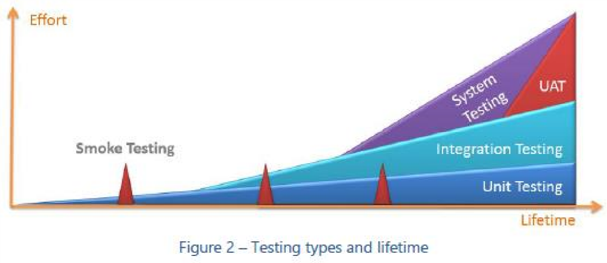
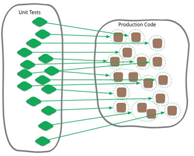
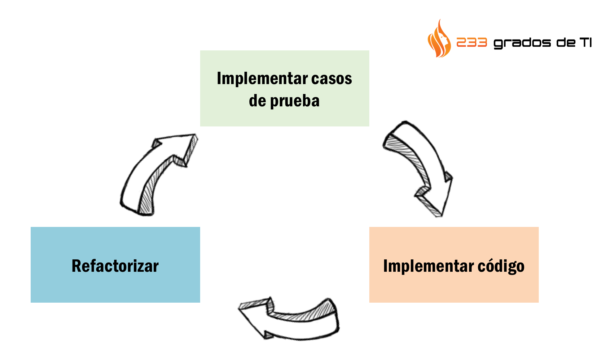

# Clase 6

## Planning del día

1. Repaso clase anterior
2. ¿Por qué necesitamos probar nuestros componentes?
3. ¿Qué es un test unitario?
4. Jest
5. Entendiendo las partes de vue-test-utils
6. Probando componentes visuales
7. Testeando partes asíncronas
8. Probando vue-router
9. Probando vuex

## Índice

- [1. Introducción al testing automático](#1-introducción-al-testing-automático)
  - [1.1. Qué es un test automático](#11-qué-es-un-test-automático)
  - [1.2. Para qué son útiles](#12-para-qué-son-útiles)
  - [1.3. Tipos de test](#13-tipos-de-test)
  - [1.4. Test unitarios](#14-test-unitarios)
  - [1.5. Partes de un test unitario](#15-partes-de-un-test-unitario)
- [2. Jest](#2-jest)
  - [2.1. Qué es](#21-qué-es)
  - [2.2. Funcionalidades principales](#22-funcionalidades-principales)
  - [2.3. Cómo se instala](#23-cómo-se-instala)
  - [2.4. Partes de un test unitario en Jest](#24-partes-de-un-test-unitario-en-jest)
  - [2.5. Nuestro primer test](#25-nuestro-primer-test)
- [3. vue-test-utils](#3-vue-test-utils)
  - [3.1. Renderizando componentes](#31-renderizando-componentes)
  - [3.2. Encontrando elementos en el componente](#32-encontrando-elementos-en-el-componente)
  - [3.3. Testeando props](#33-testeando-props)
  - [3.4. Testeando propiedades computadas](#34-testeando-propiedades-computadas)
  - [3.5. Testeando formularios](#35-testeando-formularios)
  - [3.6. Testeando emisión de eventos](#36-testeando-emisión-de-eventos)
  - [3.7. Mockeando objetos globales](#37-mockeando-objetos-globales)
- [Ejercicio (I): arregla los tests](#ejercicio-i-arregla-los-tests)
  - [3.8. Testeando vue-router](#38-testeando-vue-router)
  - [3.9. Testeando vuex](#39-testeando-vuex)
    - [3.9.1. Mutaciones](#391-mutaciones)
    - [3.9.2. Acciones](#392-acciones)
    - [3.9.3. Getters](#393-getters)
- [Ejercicio (II): inserta los tests](#ejercicio-ii-inserta-los-tests)

## 1. Introducción al testing automático

### 1.1. Qué es un test automático

El testing de software es el arte de medir y mantener la calidad del software para asegurar que las expectativas y requerimientos del usuario, el valor de negocio, los requisitos no funcionales como la seguridad, confiabilidad y tolerancia a fallos, y las políticas operacionales se cumplan. El testing es un esfuerzo del equipo para conseguir un mínimo de calidad y tener una “definición de hecho” entendida y aceptada por todos.

> Definición de hecho – es una definición del equipo y un compromiso de calidad que se aplicará a la solución en cada iteración (también se puede definir en el nivel de Tareas o de Historias de Usuario). Ten en cuenta el diseño, las revisiones de código, refactorización y testing cuando discutáis y defináis vuestra “definición de hecho”.

### 1.2. Para qué son útiles

Cuando alguien pregunta por qué son importantes los tests, le solemos preguntar si creen que es importante que un avión comercial que usan habitualmente para cruzar océanos sea testeado meticulosamente antes de cada vuelo. ¿Es importante que el avión sea testeado? Si, ok, ahora, ¿es importante que el altímetro sea testeado aparte? Por supuesto. Eso es el test unitario… testear el altímetro. No garantiza que el avión vaya a volar, pero no puede volar de forma segura sin él.

La importancia de los test, empieza con el proyecto y continúa durante todo el ciclo de vida de la aplicación, también depende de si estamos buscando:

- Código de calidad desde el principio.
- Menos bugs.
- Código auto explicativo.
- Reducir el coste de corregir errores encontrándolos lo antes posible.
- Sentido de responsabilidad del código, estar orgullosos de nuestro código.

### 1.3. Tipos de test

- **Test exploratorio**: El tester imagina posibles escenarios que no se hayan cubierto por otros test. Es muy útil cuando se observa al usuario usando el sistema. NO hay test predefinidos.
- **Test de integración**: Testear diferentes componentes de la solución trabajando como si fueran uno.
- **Test de carga**: Testear cómo se comporta el sistema con cargas de trabajo en un entorno controlado.
- **Test de Regresión**: Asegura que el sistema mantiene los mínimos de calidad después de hacer cambios como corregir bugs. Usa una mezcla de tests unitarios y de sistema.
- **Smoke Test**: Se usa para testear una nueva característica o idea antes de subir al repositorio de código los cambios.
- **Test de sistema**: Testea el sistema completo con características fijas y comprueba los requerimientos no funcionales.
- **Test unitario**: Un test de la unidad más pequeña de código (método, clase, etc.) que puede ser testeada de manera aislada del sistema. Ver Verifying Code By Using Unit Test yLa delgada línea entre buen y mal test unitario en esta guía para más información.
- **Test de aceptación de usuario**: Cuando se acerca el final de los ciclos del producto, se invita a los usuarios a que realicen test de aceptación en escenarios reales, normalmente basados en casos de tests




### 1.4. Test unitarios

El tipo de test en el que nos centraremos es el denominado test unitario. Los test unitarios son los tests encargados de probar, de manera aislada, cada una de las piezas y sus posibles configuraciones de las que está compuesta una unidad de código. Por unidad de código podemos pensar en un componente, una clase, una función o un procedimiento. Dependerá de la prueba que queramos llevar a cabo.



Una técnica de desarrollo es la denóminada TDD:

La programación TDD (Test Driven Development) es una técnica de diseño e implementación de software incluida dentro de la metodología XP (Extreme Programming). Esta técnica nos permite obtener una cobertura de pruebas muy alta, aunque es importante destacar que este índice no indica que tengamos una buena calidad de tests. Por lo tanto, no debe ser un valor en el que fijarse únicamente. El proceso TDD podemos reducirlo a los siguientes pasos:

1. Escribimos una prueba que recoja nuestros requisitos.
2. Ejecutamos la prueba. Esta debe fallar, en caso contrario es que no estamos desarrollándola bien, por lo tanto no es válida.
3. Se escribe la mínima cantidad de código necesaria para que el test pase.
4. Se vuelve a ejecutar la prueba, esta debe correr exitosamente.
5. Se recomienda refactorizar el código escrito, ya que cualquier cambio que hagamos vamos a estar seguros que nuestro código va funcionar si los tests son favorables.
6. Repetimos el punto uno para el siguiente requisito.

La TDD nos aportar una cobertura de código entre un 90% y 100%, lo que indica que añadir nuevas funcionalidades va ser fácil, ya que nos da una alta confianza sobre nuestro código. Igualmente, TDD se puede compaginar con pruebas unitarias sin problema (incluso es recomendable hacerlo). Es cierto que esta metodología tiene una curva de aprendizaje algo lenta al principio, porque cambia nuestra forma de plantearnos el desarrollo, pero una vez arrancados este proceso es ágil y rápido.

También puede parecer que es un gasto de recursos, ya que el tiempo que estás aprendiendo TDD no estás produciendo, pero no es así. No se trata de una inversión a corto plazo, sino a largo plazo de cara al mantenimiento del código una vez estemos alojados en producción. En proyectos en los que no se tienen buenos tests puede ser un dolor de cabeza añadir nuevas funcionalidades o actualizaciones de las mismas. En este sentido, pueden llegar casos en los que plantearse echar abajo todo el código y empezar de nuevo, debido a la gran deuda técnica que se arrastra con un código insostenible.



### 1.5. Partes de un test unitario

Para probar nuestro código necesitamos entender las diferentes partes en las que se divide una suit de test. Expliquémoslo con un poco de pseudocódigo:

```js
test('Mi primer test', () => {
  caso('Mi primer caso', () => {
    // código de mi test
  })

  caso('Mi segundo caso', () => {
    // código de mi test
  })
})
```

Por lo general, cuando queremos probar un proyecto (imaginemos que uno con componentes), tendremos una suit de test. Esta suit se va dividiendo en diferentes test que van probando cada uno de los componentes.

Para definir un test lo haremos con palabras reservada como `test` o  `discribe` que ns permitirán definir la prueba que queremos realizar.

Internamente, incluíremos toda una serie de casos de pruebas que probarán cada uno de ls diferentes flujos por los que mi código puede pasar. Reconocerás cada uno de estos casos porque se definen con la palabra `case` o `it`. Lo mismo, les podremos indicar un nombre específico.

Si nos detenemos en cada uno de los siguienes casos, veremos que casi siempre los 3 se basan en tres partes:

```js
test('Mi primer test', () => {
  caso('Mi primer caso', () => {
    const ok = { name: 'Jose' }

    const mensaje = getHelloName(ok)

    espero(mensaje).sea.igual.a('Hola ' + ok.name)
  })
})
```

La primera parte del test se encuentra reservada a la **preparación** de los datos que necesita un test. Esto es, los datos de entrada necesrios que el método que yo estoy probando, me devuelvan los datos que tienen que ser.

La segunda parte se basa en la ejecución del método con los datos de entrada preparados. Es la fase de **actuación**.

Y por último, necesitamos **confirmar** que lo devuelvo por el componente, es la salida correcta y esperada.

Esto en el mundo de test unitarios es lo que se conoce como la triple AAA (del inglés Arrange-Act-Assert).

Vamos ahora a conocer la herramienta que vamos a utilizar para realizar estos test que hemos visto en pseudocódigo.

## 2. Jest

### 2.1. Qué es

- Plataforma de pruebas
- Configuración cero
- Potente librería de mocking
- Potente herramienta de linea de comandos
- Potente reporting de estado
- Potente librería de snapshots
- Funciona con ES6 y Typescript

### 2.3. Cómo se instala

Es tan fácil como instalar la dependencia `jest` en nuestro proyecto:

```sh
npm install --save-dev jest
```

Debido a que `jest`es una plataforma de configuración cero. Simplemete tenemos que empezar a testear elementos de nuestra aplicación. Por ejemplo, este módulo:

```js
function sum(a, b) {
  return a + b;
}
module.exports = sum;
```

Su test sería:

```js
const sum = require('./sum');

test('adds 1 + 2 to equal 3', () => {
  expect(sum(1, 2)).toBe(3);
});
```

Si creamos esta tarea en nuestro `package.json`:

```js
{
  "scripts": {
    "test": "jest"
  }
}
```

Podemos ejecutar los test con `npm test` y ver los resultados:

```sh
PASS  ./sum.test.js
✓ adds 1 + 2 to equal 3 (5ms)
```

Otra cosa sería si lo que necesitamos es que nuestro sistema funcione con ES6. En ese caso necesitamos una configuración mínima.

Instalamos todo lo necesario:

```sh
npm i --save-dev babel-jest babel-core babel-preset-env
```

En el fichero `.bavelrc` que se tiene que encontrar en la raíz, tenemos que indicar lo siguiente:

```json
{
  "presets": ["env"]
}
```

Con esto indicamos la versión de babel y las reglas de ES6 que tiene que cumplir como mínimo para compilar. Con esto tendríamos todo montado.

Si ejecutamos `npm test` se ejecutarán nuestros test sobre código ES6.

### 2.4. Partes de un test unitario en Jest

Un test en Jest es tan limpio como lo que veíamos anteriormente:

```js
import math from '../src/math'

describe('descripción de mi suite', () => {
  it('descripción de mi caso', () => {
    // preparacion
    const a = 1
    const b = 3

    // ejecución
    const result = math.add(a, b)

    // afirmación
    expect(result).toBe(4)
  })
})
```

### 2.5. Nuestro primer test

```js
describe('HelloWorld.vue', () => {
  it('renders props.msg when passed', () => {
    const msg = 'new message'
    const wrapper = shallowMount(HelloWorld, {
      propsData: { msg }
    })
    expect(wrapper.text()).toMatch(msg)
  })
})
```

## 3. vue-test-utils

`vue-test-utils` es la librería creada por el equipo de vue para realizar test unitarios sobre todos y cada uno de los elementos de los que está compuestos una aplicación web realizada con vue.

Entre sus funcionalidades nos encontramos:

- La posibilidad de renderizar componentes de manera completa o parcial sin necesidad de navegador o compilador.
- La posibilidad de seleccionar elementos del DOM del componente para hacer comprobaciones.
- La posibilidad de simular eventos tanto de DOM como personalizados de vue.
- La posibilidad de mockear piezas globales que se encuentran acopladas a nuestro componente.

Veamos diferentes técnicas para probar los elementos de nuestro componente:

### 3.1. Renderizando componentes

Una de las características más famosas de `vue-test-utils` es la posibilidad que nos da de renderizar y envolver ese renderizado en una capa que nos sea fácil de manipular para hacer comprobaciones entre ella.

Además, vamos a encontrar dos formas de renderizar un componente con  `vue-test-utils`.

Imaginemos que contamos con estos dos componentes:

Un componente hijo:

```js
const Child = Vue.component("Child", {
  name: "Child",

  template: "<div>Child component</div>"
})
```

Y un componente padre que hace uso del componente hijo anterior:

```js
const Parent = Vue.component("Parent", {
  name: "Parent",

  template: "<div><child /></div>"
})
```

Ahora bien, `vue-test-utils` nos permite realizar un renderizado completo o parcial de los componentes a probar.

De esto se encargan `shallowMount` y `mount`. Veamos qué ocurre si renderizo el componente `Child` con estos dos envoltorios:

```js
const shallowWrapper = shallowMount(Child)
const mountWrapper = mount(Child)

console.log(shallowWrapper.html())
console.log(mountWrapper.html())
```

El resultado final de ambos es el siguiente:

```html
<div>Child component</div>
```

Tiene sentido porque el componente `Child` con contenía más componentes hijos internamente, por lo tanto `shallow` y `mount` devuelven lo mismo.

Ahora bien, veamos cómo cambia el comportamiento al renderizar el componente `Parent`:

```js
const shallowWrapper = shallowMount(Parent)
const mountWrapper = mount(Parent)

console.log(shallowWrapper.html())
console.log(mountWrapper.html())
```

El `mountWrapper` devuelve:

```html
<div><div>Child component</div></div>
```

Y el `shallowWrapper` devuelve;

```html
<div><vuecomponent-stub></vuecomponent-stub></div>
```

Esto se debe a que `mount` hace un renderizado total de todo el componente y `shallow` stubea todos los componentes hijos que encuentra, haciendo un renderizado parcial.

Tener estas dos alternativas, nos puede ayudar a realizar test que se ejecutan más rápidos y a centrarnos en las partes de renderizado que a nosotros nos interesa. Según el contexto necesitaremos el uso de uno u de otro.

### 3.2. Encontrando elementos en el componente

`vue-test-utils` y sus renderizadores `mount` y `shallow` devuelven unos envoltorios con funcionalidad muy útil para realizar búsquedas en el HTML renderizado.

Veamos este componente hijo:

```html
<template>
  <div>Child</div>
</template>
```

```js
<script>
export default {
  name: "Child"
}
</script>
```

Y también este componente padre:

```html
<template>
  <div>
    <span v-show="showSpan">
      Parent Component
    </span>
    <Child v-if="showChild" />
  </div>
</template>
```

```js
<script>
import Child from "./Child.vue"

export default {
  name: "Parent",

  components: { Child },

  data() {
    return {
      showSpan: false,
      showChild: false
    }
  }
}
</script>
```

Un test bastante importante podría ser el `span` donde hay un  `v-show="showSpan"` se muestra o no. Esto estaría pobando que el funcionamiento de `showSpan` siempre es el esperado. Para hacer esto, incluímos el siguiente test:

```js
import { mount, shallowMount } from "@vue/test-utils"
import Parent from "@/components/Parent.vue"

describe("Parent", () => {
  it("does not render a span", () => {
    const wrapper = shallowMount(Parent)

    expect(wrapper.find("span").isVisible()).toBe(false)
  })
})
```

Este test realiza un renderizado con `shallow` ya que lo que ocurra en el hijo no nos interesa. Después, utilizá el método `find` para buscar elementos en el DOM (como hacíamos con jQuery) y confirma si no está visible.

Podríamos hacer otro test, donde comprobasemos qué tiene que pasar cuando `showSpan` es `true`. Veamos:

```js
it("does render a span", () => {
  const wrapper = shallowMount(Parent, {
    data() {
      return { showSpan: true }
    }
  })

  expect(wrapper.find("span").isVisible()).toBe(true)
})
```

En este caso, pasamos la inicialización de `data` dentro del `shallow` de esta manera, `showSpan` estará a `true`. De esta forma, la confirmación ahora tiene que ser que el `span` esté visible.

----

Podemos usar `find`de varias maneras, por ejemplo. Puedo indicarle si se encuentra un componente entero:

```js
import Child from "@/components/Child.vue"

it("does not render a Child component", () => {
  const wrapper = shallowMount(Parent)

  expect(wrapper.find(Child).exists()).toBe(false)
})
```

Tambien, indicando el nombre del componente que queremos encontrar:

```js
it("renders a Child component", () => {
  const wrapper = shallowMount(Parent, {
    data() {
      return { showChild: true }
    }
  })

  expect(wrapper.find({ name: "Child" }).exists()).toBe(true)
})
```

Existe otro método de búsqueda llamado `findAll` que nos encuentra todos los elementos que le indiquemos.

En este componente vemos que se generarán tres elementos `Child`:

```html
<template>
  <div>
    <Child v-for="id in [1, 2 ,3]" :key="id" />
  </div>
</template>
```

```js
<script>
import Child from "./Child.vue"

export default {
  name: "ParentWithManyChildren",

  components: { Child }
}
</script>
```

En el test, podemos confirmar que se renderizarán 3 componentes `Child`:

```js
it("renders many children", () => {
  const wrapper = shallowMount(ParentWithManyChildren)

  expect(wrapper.findAll(Child).length).toBe(3)
})
```

### 3.3. Testeando props

Si pensamos en las `props`, son como los parámetros de entrada de una función. Por tanto, son un buen lugar para encontrar comportamientos específicos de nuestro componente.

Gracias a `vue-test-utils` podemos inyectar propiedades específicas en nuestros componentes, renderizarlos y hacer afirmaciones.

Tenemos el siguiente componente:

```html
<template>
  <div>
    <span v-if="isAdmin">Admin Privledges</span>
    <span v-else>Not Authorized</span>
    <button>
      {{ msg }}
    </button>
  </div>
</template>
```

```js
<script>
export default {
  name: "SubmitButton",

  props: {
    msg: {
      type: String,
      required: true
    },
    isAdmin: {
      type: Boolean,
      default: false
    }
  }
}
</script>
```

Veamos cómo pasar las propiedades que son obligatorias al componente para que no falle:

```js
import { shallowMount } from '@vue/test-utils'
import SubmitButton from '@/components/SubmitButton.vue'

describe('SubmitButton.vue', () => {
  it("displays a non authorized message", () => {
    const msg = "submit"
    const wrapper = shallowMount(SubmitButton,{
      propsData: {
        msg: msg
      }
    })

    console.log(wrapper.html())

    expect(wrapper.find("span").text()).toBe("Not Authorized")
    expect(wrapper.find("button").text()).toBe("submit")
  })
})
```

También podemos pasar la propiedad booleana para afirmar los diferentes casos y comportamientos:

```js
import { shallowMount } from '@vue/test-utils'
import SubmitButton from '@/components/SubmitButton.vue'

describe('SubmitButton.vue', () => {
  it('displays a admin privledges message', () => {
    const msg = "submit"
    const isAdmin = true
    const wrapper = shallowMount(SubmitButton,{
      propsData: {
        msg,
        isAdmin
      }
    })

    expect(wrapper.find("span").text()).toBe("Admin Privledges")
    expect(wrapper.find("button").text()).toBe("submit")
  })
})
```

Como los dos casos hacen uso de un `shallow` parecido, no es mala idea generar refactores que nos faciliten los test. Por ejemplo, en este caso eneramos una factoría que nos devolvería el envoltorio necesario:

```js
const msg = "submit"
const factory = (propsData) => {
  return shallowMount(SubmitButton, {
    propsData: {
      msg,
      ...propsData
    }
  })
}
```

Ahora los dos casos se quedan mucho más limpios y centrados en lo que necesitamos:

```js
describe("SubmitButton", () => {
  describe("has admin privledges", ()=> {
    it("renders a message", () => {
      const wrapper = factory()

      expect(wrapper.find("span").text()).toBe("Not Authorized")
      expect(wrapper.find("button").text()).toBe("submit")
    })
  })

  describe("does not have admin privledges", ()=> {
    it("renders a message", () => {
      const wrapper = factory({ isAdmin: true })

      expect(wrapper.find("span").text()).toBe("Admin Privledges")
      expect(wrapper.find("button").text()).toBe("submit")
    })
  })
})
```

### 3.4. Testeando propiedades computadas

Probar propiedades computadas es bastante sencillo ya que al final no dejan de ser funciones puras de JavaScript.

Veamos este componente que cuenta con una propiedas computada:

```html
<template>
  <div>
    {{ numbers }}
  </div>
</template>
```

```js
<script>
export default {
  name: "NumberRenderer",

  props: {
    even: {
      type: Boolean,
      required: true
    }
  },

  computed: {
    numbers() {
        const evens = []
        const odds = []

        for (let i = 1; i < 10; i++) {
            if (i % 2 === 0) {
                evens.push(i)
            } else {
                odds.push(i)
            }
        }

        return this.even === true ? evens.join(", ") : odds.join(", ")
    }
  }
}
</script>
```

Podemos hacer dos tipos de pruebas. O comprobar que el componente renderiza los datos esperados:

```js
import { shallowMount } from "@vue/test-utils"
import NumberRenderer from "@/components/NumberRenderer.vue"

describe("NumberRenderer", () => {
  it("renders even numbers", () => {
    const wrapper = shallowMount(NumberRenderer, {
      propsData: {
        even: true
      }
    })

    expect(wrapper.text()).toBe("2, 4, 6, 8")
  })
})
```

O ejecutar la propiedad computada directamente con el contexto que necesita:

```js
it("renders odd numbers", () => {
  const localThis = { even: false }

  expect(NumberRenderer.computed.numbers.call(localThis)).toBe("1, 3, 5, 7, 9")
})
```

Ambas son válidas. Sin embargo, la segunda opción prueba de forma más unitaria la computada. Puede que en el primer caso algún factor se involucre en el resultado final y que quede algo desvirtuado.

### 3.5. Testeando formularios

Otra parte importante a probar en un formulario son las entradas que el usuario puede ussar para interaccionar con nuestra aplicación: los formularios.

`vue-test-utils` y su envoltorio sobre el componente renderizado, nos va a permitir introducir datos en los inputs para realizar pruebas sobre los resultados.

Veamos:

```html
<template>
  <div>
    <form @submit.prevent="handleSubmit">
      <input v-model="username" data-username>
      <input type="submit">
    </form>

    <div
      class="message"
      v-show="submitted"
    >
      Thank you for your submission, {{ username }}.
    </div>
  </div>
</template>
```

```js
<script>
  export default {
    name: "FormSubmitter",

    data() {
      return {
        username: '',
        submitted: false
      }
    },

    methods: {
      handleSubmit() {
        this.submitted = true
      }
    }
  }
</script>
```

Su test sería el siguiente:

```js
import { shallowMount } from "@vue/test-utils"
import FormSubmitter from "@/components/FormSubmitter.vue"

describe("FormSubmitter", () => {
  it("reveals a notification when submitted", () => {
    const wrapper = shallowMount(FormSubmitter)

    wrapper.find("[data-username]").setValue("alice")
    wrapper.find("form").trigger("submit.prevent")

    expect(wrapper.find(".message").text())
      .toBe("Thank you for your submission, alice.")
  })
})
```

Lo que hacemos es montar el componente, insertar los datos y emitir el evento `submit.prevent` con la función `trigger`. Después confirmamos si los resultados del submit es el esperado.

### 3.6. Testeando emisión de eventos

Otra parte de un componente que nos puede traer problemas es la emisión de eventos personalizados. Cuanto antes podamos tener identificado su comportamiento, antes podremos indicar un test y de esa manera obtener feedback cuando no se comporte como esperamos.

Tenemos este componente que ejecuta una emisión de evento:

```html
<template>
  <div>
  </div>
</template>
```

```js
<script>
  export default {
    name: "Emitter",

    methods: {
      emitEvent() {
        this.$emit("myEvent", "name", "password")
      }
    }
  }
</script>
```

Lo que hacemos es un test como este:

```js
import Emitter from "@/components/Emitter.vue"
import { shallowMount } from "@vue/test-utils"

describe("Emitter", () => {
  it("emits an event with two arguments", () => {
    const wrapper = shallowMount(Emitter)

    wrapper.vm.emitEvent()

    console.log(wrapper.emitted())
  })
})
```

El test lo que hace es ejecutar el método `emitEvent` que es el responsable de realizar la emisión. El wrapper lo que tiene es un método que nos permite saber si se ha emitido el evento.

### 3.7. Mockeando objetos globales

Como hemos ido viendo a lo largo del curso, contar con funcionalidad extra en vue es muy sencillo porque todas las librerías y plugins se van propagando por el árbol de componentes, lo que nos permite hacer uso de ellas.

Sin embargo, hacer uso de ellas nos puede traer problemas a la hora de realizar pruebas unitarias ya que aislar comportamientose se complica.

Veamos un componente que hace uso de la librería `translate` para la localización de literales:

```html
<template>
  <div class="hello">
    {{ $t("helloWorld") }}
  </div>
</template>
```

```js
<script>
  export default {
    name: "Bilingual"
  }
</script>
```

Cuando ejecutaramos este test:

```js
import { shallowMount } from "@vue/test-utils"
import Bilingual from "@/components/Bilingual.vue"

describe("Bilingual", () => {
  it("renders successfully", () => {
    const wrapper = shallowMount(Bilingual)
  })
})
```

Tendríamos un error ya que `vue-test-util` al renderizar no encuentra ninguna referencia a esta librería.

Para solucionar esto, `vue-test-utils` nos permite mockear elementos globales con la palabra `mocks`:

```js
import { shallowMount } from "@vue/test-utils"
import Bilingual from "@/components/Bilingual.vue"

describe("Bilingual", () => {
  it("renders successfully", () => {
    const wrapper = shallowMount(Bilingual, {
      mocks: {
        $t: (msg) => msg
      }
    })
  })
})
```

Si vemos que se va a necesitar algo para muchos test o casos, podemos mockearlo de manera global de la siguiente manera:

```js
import VueTestUtils from "@vue/test-utils"

VueTestUtils.config.mocks["mock"] = "Default Mock Value"
```

O de esta manera:

```js
import VueTestUtils from "@vue/test-utils"
import translations from "./src/translations.js"

const locale = "en"

VueTestUtils.config.mocks["$t"] = (msg) => translations[locale][msg]
```

Ahora el test funcionará correctamente y devolverá el resultado esperado:

```js
describe("Bilingual", () => {
  it("renders successfully", () => {
    const wrapper = shallowMount(Bilingual)

    console.log(wrapper.html())
  })
})
```

----

## Ejercicio (I): arregla los tests

Dado el proyecto de vue `ejercicios/01-arregla-test`, intenta arreglar test automáticos para evitar poder subir los cambios al repositorio.

----

### 3.8. Testeando vue-router

Ya que hemos aprendido cómo probar elementos globales, veamos cómo podemos probar diferentes partes de `vue-router`.

Tenemos este componente que cuenta con un `router-view`:

```html
<template>
  <div id="app">
    <router-view />
  </div>
</template>
```

```js
<script>
export default {
  name: 'app'
}
</script>
```

Y otro componente que se anida internamente dentro del otro gracias a `vue-router`:

```html
<template>
  <div>Nested Route</div>
</template>
```

```js
<script>
export default {
  name: "NestedRoute"
}
</script>
```

Solo nos queda configurar su ruta:

```js
import NestedRoute from "@/components/NestedRoute.vue"

export default [
  { path: "/nested-route", component: NestedRoute }
]
```

```js
import Vue from "vue"
import VueRouter from "vue-router"
import routes from "./routes.js"

Vue.use(VueRouter)

export default new VueRouter({ routes })
```

Tenemos una forma de incluir una librería externa por medio de `createLocalVue`. Lo que nos permite es crear una instancia de vue en memoria para que podamos cargar los diferentes plugins que necesitamos:

```js
import { shallowMount, mount, createLocalVue } from "@vue/test-utils"
import App from "@/App.vue"
import VueRouter from "vue-router"
import NestedRoute from "@/components/NestedRoute.vue"
import routes from "@/routes.js"

const localVue = createLocalVue()
localVue.use(VueRouter)

describe("App", () => {
  it("renders a child component via routing", () => {
    const router = new VueRouter({ routes })
    const wrapper = mount(App, { localVue, router })

    router.push("/nested-route")

    expect(wrapper.find(NestedRoute).exists()).toBe(true)
  })
})
```

El test lo que hace es comprobar que la navegación a `NestedRoute`se hace correctamente.

### 3.9. Testeando vuex

Por otra parte, meter test en `vuex` es una buena idea porque es una parte de la aplicación que más errores puede tener po jugar tanto con el estado.

Vamos a ver cómo probar tres partes que podrían ser un foco de errores: las mutaciones, las acciones y los getters:

#### 3.9.1. Mutaciones

Hagamos un poco de TDD.

Primero creamos una interfaz que queremos que que tenga nuestra mutación. No definimos código de implementación, simplemente el nombre de la mutación y las entradas permitidas:

```js
export default {
  SET_POST(state, { post }) {

  }
}
```

Lo siguiente es crear un test que realice los diferentes casos que necesitamos que cumpla:

```js
import mutations from "@/store/mutations.js"

describe("SET_POST", () => {
  it("adds a post to the state", () => {
    const post = { id: 1, title: "Post" }
    const state = {
      postIds: [],
      posts: {}
    }

    mutations.SET_POST(state, { post })

    expect(state).toEqual({
      postIds: [1],
      posts: { "1": post }
    })
  })
})
```

En este caso, lo que necesitamos es que dado un estado vacío y un post, la mutación nos inserte dicho post dentro del estado.

Lógicamente, al no haber ninguna implementación, Jest nos devuelve un error:

```markdown
FAIL  tests/unit/mutations.spec.js
● SET_POST › adds a post to the state

  expect(received).toEqual(expected)

  Expected value to equal:
    {"postIds": [1], "posts": {"1": {"id": 1, "title": "Post"}}}
  Received:
    {"postIds": [], "posts": {}}
```

Lo que tenemos que hacer es implementar el comportamiento de la mutación para que devuelva lo esperado. Primero hacemos el `push` del `id`:

```js
export default {
  SET_POST(state, { post }) {
    state.postIds.push(post.id)
  }
}
```

Nos sigue devolviendo un erro al ejecutarlo, aunque ahora es diferente, ya se va pareciendo al resultado esperado:

```markdown
Expected value to equal:
  {"postIds": [1], "posts": {"1": {"id": 1, "title": "Post"}}}
Received:
  {"postIds": [1], "posts": {}}
```

Solo nos queda guardar el post de la manera marcada por el test:

```js
export default {
  SET_POST(state, { post }) {
    state.postIds.push(post.id)
    state.posts = { ...state.posts, [post.id]: post }
  }
}
```

Esto ya hará que el test se ponga en verde. Desarrollar de esta forma, hace que pensemos más en el diseño de las diferentes partes y que probar sea más sencillo.

#### 3.9.2. Acciones

El problema con las acciones nos va a venir de la asincronía y de las librerías que usamos para hacer llamadas ajax.

Veamos la siguiente acción:

```js
import axios from "axios"

export default {
  async authenticate({ commit }, { username, password }) {
    const authenticated = await axios.post("/api/authenticate", {
      username, password
    })

    commit("set_authenticated", authenticated)
  }
}
```

Y su test:

```js
describe("authenticate", () => {
  it("authenticated a user", async () => {
    const commit = jest.fn()
    const username = "alice"
    const password = "password"

    await actions.authenticate({ commit }, { username, password })

    expect(url).toBe("/api/authenticate")
    expect(body).toEqual({ username, password })
    expect(commit).toHaveBeenCalledWith(
      "SET_AUTHENTICATED", true)
  })
})
```

En el test hay cosas interesantes. Por ejemplo. Estás mockeando el `commit` interno para que no se ejecute la mutación ya que no nos interesa. Queremos aislar la pieza sin involucrar a más.

Lo siguiente que hacemos es ejecutar asíncronamente la acción. Lo hacemos así, para esperar a los resultados. Este test, logicamente, sigue fallando:

```markdown
 FAIL  tests/unit/actions.spec.js
  ● authenticate › authenticated a user

    SyntaxError: The string did not match the expected pattern.

      at XMLHttpRequest.open (node_modules/jsdom/lib/jsdom/living/xmlhttprequest.js:482:15)
      at dispatchXhrRequest (node_modules/axios/lib/adapters/xhr.js:45:13)
      at xhrAdapter (node_modules/axios/lib/adapters/xhr.js:12:10)
      at dispatchRequest (node_modules/axios/lib/core/dispatchRequest.js:59:10)
```

El test falla por el uso de `axios`. Lo que vamos a hacer es decirle a Jest que nos mockee la llamda y nos devuelve un dato que a nosotros nos interese:

```js
let url = ''
let body = {}

jest.mock("axios", () => ({
  post: (_url, _body) => {
    return new Promise((resolve) => {
      url = _url
      body = _body
      resolve(true)
    })
  }
}))
```

De esta manera, hemos aislado todalmente la acción. Ya no interacciona ni con mutaciones ni con llamadas AJAX. Evitamos efectos laterales y dependencias externas que no nos interesan para probar esa pieza.

#### 3.9.3. Getters

Por último, nos queda probar los getters, Recuerda que los `getters` servían para transformar el estado o para realizar queries sobre el mismo.

Veamos cómo probamos este getter a partir de este estado:

```js
const state = {
  dogs: [
    { name: "lucky", breed: "poodle", age: 1 },
    { name: "pochy", breed: "dalmatian", age: 2 },
    { name: "blackie", breed: "poodle", age: 4 }
  ]
}
```

```js
export default {
  poodles: (state) => {
    return state.dogs.filter(dog => dog.breed === "poodle")
  },

  poodlesByAge: (state, getters) => (age) => {
    return getters.poodles.filter(dog => dog.age === age)
  }
}
```

```js
computed: {
  puppies() {
    return this.$store.getters.poodlesByAge(1)
  }
}
```

Los `getters` son funciones puras, por lo que hacer pruebas es bastante sencillo. Simplemente, pásale el estado de inicio que quieras, ejecuta el `getter` y comprueba que los resultados son los esperados:

```js
import getters from "../../src/store/getters.js"

const dogs = [
  { name: "lucky", breed: "poodle", age: 1 },
  { name: "pochy", breed: "dalmatian", age: 2 },
  { name: "blackie", breed: "poodle", age: 4 }
]
const state = { dogs }

describe("poodles", () => {
  it("returns poodles", () => {
    const actual = getters.poodles(state)

    expect(actual).toEqual([ dogs[0], dogs[2] ])
  })
})
```

Tanto un `getter` como el otro devuelven los datos que estamos esperando:

```js
describe("poodlesByAge", () => {
  it("returns poodles by age", () => {
    const poodles = [ dogs[0], dogs[2] ]
    const actual = getters.poodlesByAge(state, { poodles })(1)

    expect(actual).toEqual([ dogs[0] ])
  })
})
```

## Ejercicio (II): inserta los tests

Dado el proyecto de vue `ejercicios/02-inserta-test`, intenta incluir test automáticos a todos los componentes para mejorar la cobertura de test unitarios.